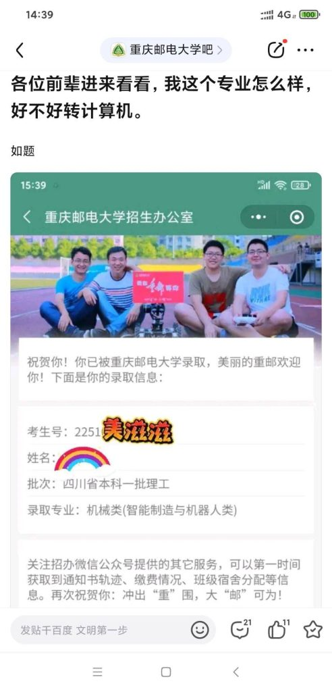

## 前言

为什么现在才来做大一的总结，其实很简单，之前没有找到合适的契机让我觉得“啊，是时候该总结了”。现在完结了一些事情所以可能是时候做个总结了。

总的来说大一过得很坎坷，遇到了数不胜数的困难，现在回过头去看我应该算是坚持了下来。

## 心素

### 伊始

刚入学的时候极度迷茫，感觉没有一天不是割裂的，高考失利还没进计算机，空有抱负无处施展。投身于学校的课程？这是一个很痛苦的过程，我本人是一个极度厌恶形式主义的人，但是恰巧学校就是这么个地方，规章制度为那些堕落的人抬高了下限，却也限制了我的上限。我不得不去参加各种毫无意义的活动，不得不的在小组活动中独揽重任，只为那一点点的分。说真的，活得太累了。即便如此，我还是在9月份之前立了一个目标

### 转专业

因为没有录到计算机专业，我一开始的想法是完了，也想过复读但父母不支持，那怎么办？就只剩下一条路（现在来看并不是这样）——转专业

转专业实话来讲轻松也不轻松，因为想转到计算机好的专业对成绩有很高的要求，但计算机差一点的专业就相对很轻松。但是人都是向上走的

求上得中，求中得下。不努力一把哪有那么容易成呢？但是就像我说的，对课程的学习给我带来的正反馈很少或者说还不适应大学的学习，我天赋也不是很高，我也就只能像个瞎子一样多刷题。我仍然记得在2217门口的自习空间做题的样子

最后虽然在一些水课上还是不尽人意，但是还是转入了计算机大数据专业

### 疫情

疫情是个很恶心的东西，从11月份就被关到了寝室里，6个人住在一个狭窄的空间，无力麻木地听着似是而非的网课。在这么极端压抑的环境中我的心理状况是非常糟糕的，我不知道该干嘛，做点什么也不知道有没有什么用，这种状况直到12月回到家才有所好转

> 我现在巴不得再来一次疫情然后我就可以狠狠地在寝室不去上课卷代码：）

### 蓝山

蓝山对我来说是一个意义重大的组织，甚至可以说改变了我的人生。

#### 故事的开始

大一刚入学，怀着学习计算机的热情与不甘我在贴吧刷各种贴子，跟大多数新生一样，看到啥啥啥就win，看到啥啥啥又感到沮丧，我与蓝山的起源来自于发的帖子

有个学长热心回答了我，事后偶然的机会发现原来就是袁神😄

后来又在新生群和贴吧了解到红岩，感觉很牛逼所以我也想加入。后来在贴吧刷到了勤奋蜂的招生贴（贴吧不准打广告，所以能被我刷到只能说冥冥之中自有天意），反正红岩还没正式招生，抱着试一试的态度的态度我就先去了勤奋蜂，也是从这里正式认识了袁神

因为21级勤奋蜂和蓝山 go 是一拨人，所以我也就跟着去了蓝山。因为感觉学长都很牛逼再加上时间和红岩冲突我也就没去红岩了

#### 坎坷的学习之旅

学开发并不是个轻松的事情，至少对于天赋不太强的我来说。在暑假学的三脚猫c语言在第一节课就吃完了老本，每次都要碰很多壁才能完成每节课的内容

wxgg觉得我们都懂所以拉的很快😩，mj学长有点小紧张，泡泡学长上课净讲底层给我听麻了😠，fxr学长每次的内容都很轻松（但因为讲的太轻松导致下来补的也很多😭），袁神我觉得讲的是最好的

磕磕绊绊我也勉强能跟上，进步最大的时候就是做项目的时候，真正实现了从0到1的突破

#### 钱塘江上潮信起，今日方知我是我

现在的我已经不像大一刚入学的时候一样懵懂迷茫，我知道了什么东西有用什么东西没用。我追求的目标是什么，该怎么通过什么方式去实现目标。

### 遗憾

可能是最近过得太顺了，生活往往也会在你骄傲的时候给你当头一棒

以此来警醒我自己

- 因为种种原因转专业没有去到计科

- CSA数据工程任务二因为查重寄了

- 大一下考的稀撇所以和保研无缘了

- 有待补充

## 展望

好像肉麻的话说的太多了捏

以后每半年总结一次

在此我也立个半年目标吧

- 完成之前魔改的app，在大三之前狠狠参加计算机设计比赛

- 多搞搞开源，争取整点有含金量的 feature 写简历

- 大二上结束前背完操作系统和计算机网络以及 go 的八股，有时间去看 mysql 和 redis 的底层实现原理

- 还是要多修炼内功，内外兼修

最后用一首歌的歌词来总结：

> 我躲在夜里取笑着黑，因为没有人能杀死鬼
