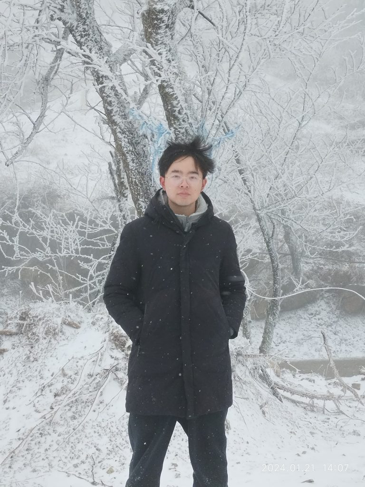
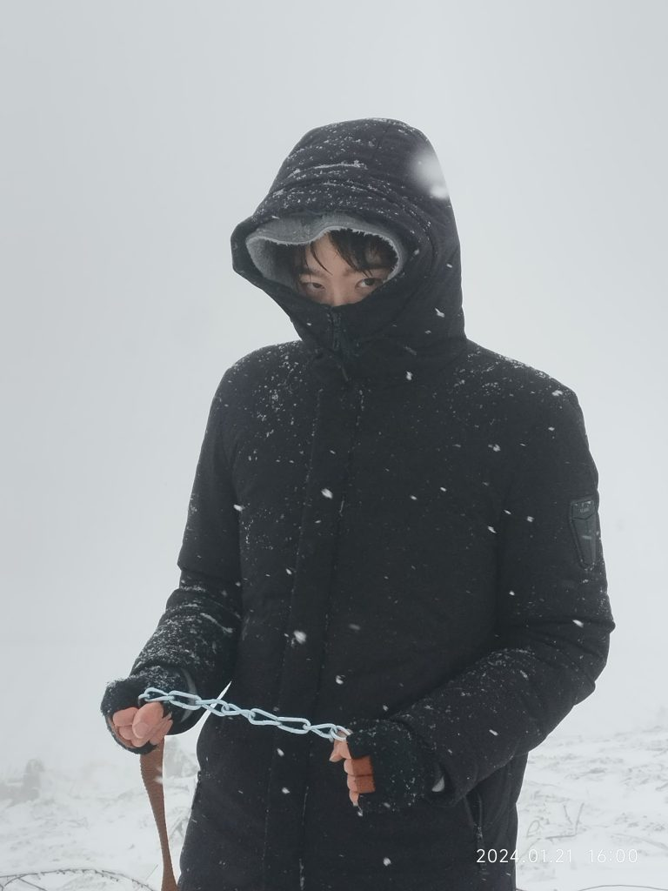

## 前言

之前说过每半年做一次年度总结，既是鞭策自己也是回顾。

## 开源

开源对于我来说是个很奇妙的旅程，我能肯定地说我从中学到了不少东西是只看八股、写项目学不来的。从23年开始一直到现在姑且也有个大半年。对照上次总结的目标也算是做了一些比较上得了台面的 feature。其中最值得吹一下的当属 SSE ，说起来这也算是我运气好，蹭到了 AIGC 的光，现在我也可以骄傲地说我也对字节跳动核心产业如抖音等作出了一些贡献（haha。也认识到了一些大佬，有哥们儿白天上班晚上回家搞开源，跨年当天还在对需求，实在是令我心生佩服。

2023年12月7日我也成功拿到了 cloudwego 社区的 commiter 证书，希望在新的一年里再接再厉。

## 大学学习

可以说现在的策略是就业为主，留条后路给考研。保研对我来说太累效率也很低（机器学习实践别人抄我的分能比我高十分？），这学期也是第一个全程没怎么学的学期，能不去的课就不去，时间全留下来 coding ，最后全放在最后两周突击，当然分数不是很好看不过也有惊无险地过了。不得不说我感觉我的天赋真的不太行，之前能小有一番成就纯靠努力。

之前说的拿去打比赛的 APP 也基本搓完了，我感觉很是比较有竞争力的。不过那些比赛无论名头有多么唬人我感觉基本可以说是水赛，含金量也不如数模国赛和ACM等高。有的要么无脑往红色主题/传统文化上蹭要么就是拿前人/导师的成果微调一下去打比赛。不过对于我来说反正也就是个名头的事情，只为了丰富简历和为考研留后路。

## Golang-BackEnd

现在也称得上是我的看家本事了，其他的诸如 C、Java、Python 只能说是鹦鹉学舌。业务代码功底我感觉已经基本达到目前能达到的上限了，再进一步只能去实习寻求突破，眼界和经验完全都会不一样。几个常见的八股例如计网、操作系统、go底层、mysql、redis也背过了一遍，但是一遍肯定是不够的，寒假就开始二轮复习，3、4月份就要做到很熟悉。技术栈上会的不少，但是精通的不多，不说了，慢慢沉淀吧，学无止境。

对于蓝山工作室，虽然我现在可能并不需要这个名头了，但是我非常珍视在工作室的伙伴们和在这里的经历，我也由衷地想留下来一些东西。we重邮更是几代人的心血，别的不说，争取在换届之前把已知的 bug 修复了，对目录结构进行优化，现在的结构一没有注释二有些模块耦合度太高，可读性太差。无论过多久，我都会骄傲地宣称自己是一个 lanshan er，我们是一个热爱技术、自由和谐、志同道合的团体。

## 雪山之旅

以前的我对于旅行并不感冒，觉得很浪费时间，但是这次旅行改变了我的看法，它非同寻常。和好朋友一起我见识到了天生城的繁华，也深陷在雪山的茫茫雪白中。旅行不是漫无目的地从一个地方去另一个地方，看了拍了照就完毕了，而是真正的心灵收获。尽管和计划中的有很大出入，但是当车子卡在雪地里的时候，我在想什么呢？这或许就是真正的 work && life balance。

## 展望

最迟暑假找到实习，中厂及以上吧

优化 we重邮 架构

继续修炼内功

> “还差一点，就能跟他们都站在一起；还差一点，就能跟他们一起去笑我自己”
