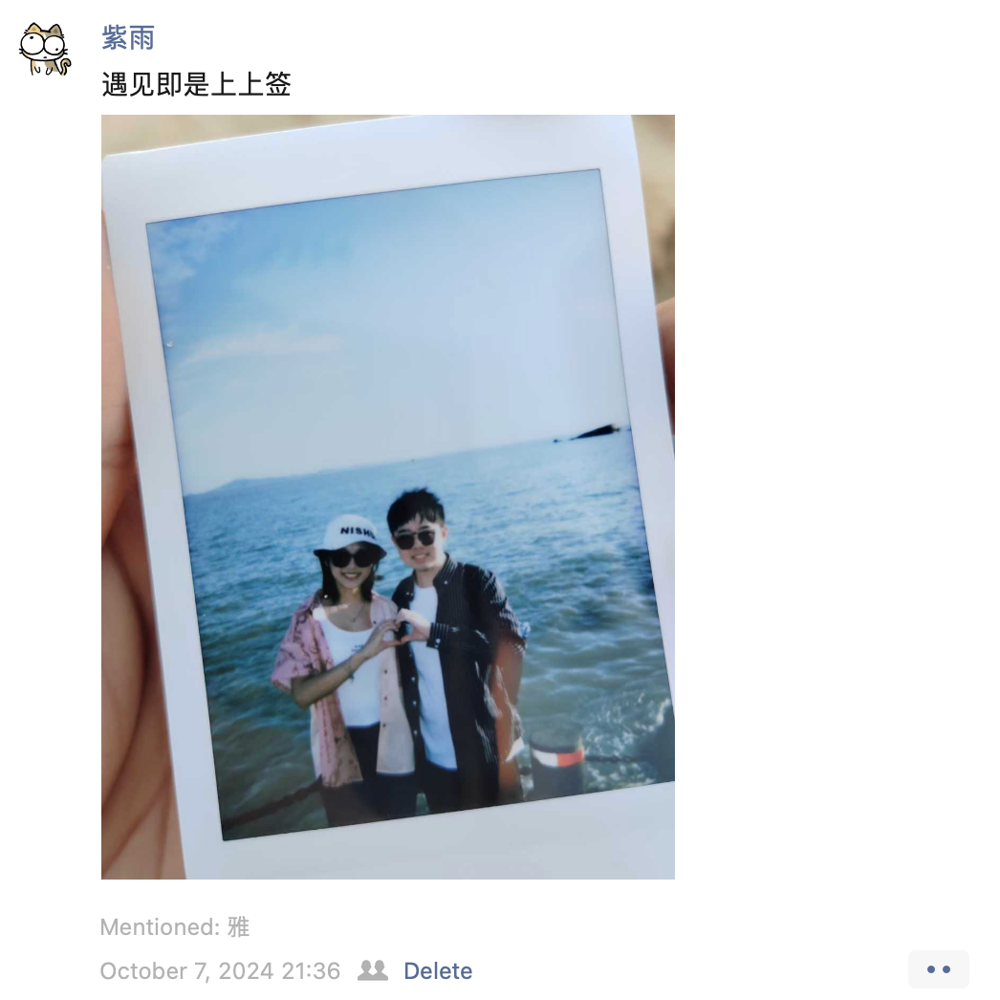

2024 甲辰年，对我来说毫无疑问是悲惨的一年，尽管可以说上大学以来所大大小小设立的阶段性目标都一一达成了，但是悲惨的是无一不是付出了很大的代价或者以扭曲的形式实现。可能就像深潜一样，潜得越深，能力也越强，所承受的压力也更大。上大学以来由于高考没取得理想的成绩，导致了性格变得愈发偏激，每次都想着我一定要怎么怎么样，没做到又怎么怎么样。最后就算达成了既定目标也很少收获到快乐，就像一架起飞就不准备落地的飞机，一直冲到燃油耗尽为止。

在潜意识中，我将用这些痛苦为我的高考赎罪。

2024 年空闲的时间并不多，一年 365 天可能真真正正完整得闲的天数可能加起来不超过 20 天，在大三上期末周倒是挤牙膏式地抽了点时间通关了《寂静岭 2 重制版》。收音机杂乱的电流声，臆想出来的拘束的怪物，破碎的结局。我就好像跟男主一起，踏上了这趟受刑之旅。

# 受刑之旅

<link rel="stylesheet" href="https://cdn.jsdelivr.net/npm/aplayer/dist/APlayer.min.css">

今年 6 月底的时候，我去了一趟学校旁边的老君洞求签，其实越是不顺的人越相信命运，因为当人遭到打击的时候没有别的什么依靠只能怪老天爷不公，而成功的人往往会更加自信。当我虔诚静心地摇完签结果却令我万万没想到 ——

***下下签***

这或许是某种证明，抑或者是某种引子，潘多拉魔盒被打开释放出了极怖之物。

在 2024.5.26 一位长辈离世之后和 2024.5.27 月饼离世之后，2024.7.16 15:00 我的外公离世了，我可能从生下来就是一个泪腺发达的人，对于男生来说不是什么好事，但是生理和基因上的事情是人类很难左右的，我可能一辈子都难以忘记站在外公病床前，望着消瘦的他，他最后用力握了我的手，我当时没说很多话，因为哽咽得难发一言。在时光面前人类是多么无能为力，对于一个普通学生来说更是如此。

我恨自己是个爱哭鬼。

最后去了外公的墓，沿着乡下的泥巴地走了很久很久，我记得我小时候就来过，外公在 2013 年就为自己留好了长眠之地，噼里啪啦响了十几分钟的鞭炮声，他之后就要一直住在这里了。

我想好了，等我死了，就把我的骨灰撒在大海里，我想自由。

等外公的葬礼结束之后，我就在家待着等待去北京实习，但是万万没想到命运又跟我开了个巨大的玩笑，所有的面试都通过过后竟然因为没有 hc 而丧失了这次机会，间接耽误了我 2 个月的时间。我苦笑安慰自己说终于不是因为自己的原因而导致失败了。之后就草草返回了学校准备开学之后另找实习，结果工作室突然校领导有紧急需求，这个任务自然就落在了我这个闲人身上，后面的结果是因为不熟悉组件加上我太粗心了再加上当时还没走出前面的阴影，结果造成了灾难性的线上事故，最终我花了2周时间，白天忙开源的事情，晚上和凌晨修复我搞的篓子，就这样我在工作室住了 2 周。

这段时间我在想什么呢？我是怎么坚持下来的呢？我只记得我不断重复着“艰难，依然坚持”，试图从根本上洗脑自己，我尝试建立起一个锚，从结果上来看，我撑过来了。我敢说我这个人不太聪明，其他缺点也不少，但是有一个优点：坚韧。

# 锚

<link rel="stylesheet" href="https://cdn.jsdelivr.net/npm/aplayer/dist/APlayer.min.css">

2024.5.25 我的 20 岁生日，同时我也做出了一个大胆的决定：向我喜欢的女生表白，或许是傻人有傻福吧，我喜欢的人也喜欢着我。

她是一个性格开朗的女孩，很优秀，人也很好看。时至今日我也为自己能找到这么一个女朋友而感到幸运。她是 INFP，我是 INFJ。在平常我的社交圈子并不广，我懒得跟陌生人在非必要的情况下交谈，那就要说到怎么跟我女朋友认识的，可以参见我去年的年度总结雪山之旅哈哈哈！

谈了女朋友之后当然会分一部分精力到她身上，她也会在她的内心中为我开辟部分空间。时至今日已和她在一起了 246 天，在这期间发生了不少事情，她就像 ***“锚”*** 一样，让我不要飘远。

所以之后厦门旅行我发了篇朋友圈推文，我也深深相信着。

# 无心

“以无心算有心”，我希望能够用我的余生践行我这句话，有的时候真的不是不努力考不上清华北大，而是真的达不到那个天赋，学习天赋到了一定地步是真的可以学一个小时顶别人十个小时的。言归正传，天赋现在肯定是无法改变的了，我觉得最好的方式是培养起高层次眼光，做出优质选择，再搭配上足够的努力，最后有一颗 ***“无心”*** 。

所谓 ”无心“，我认为是一种成全，成全他人也成全自己。不是问心无愧，而是不求事事顺心但求方向顺心，不可能万事万物都称心如意地圆满按照心想的实现，特别我也不是什么 lucky boy。在经历了今年种种不顺之后特别意识到真的生活很多时候喜欢给你开恶劣的玩笑然后看着你痛哭流涕的样子哈哈大笑，我能咋办呢？只有顺从好了哈哈哈🤣。

往往求而不得的同时也会“不求而得”，最近发生的事更是印证了我这个想法，就好比如果每天都想着出门要捡到钱，如果没捡到则会沮丧，而如果不抱着这种心理在超出预期地捡到钱之后反而会十分开心。所以我觉得有时候不能事事功利心太重，我现在就想把握大方向的同时多做备案和兜底方案。

对于 2025 年，依然充满了不确定性和挑战，我也又设立了几个目标，希望在新的一年里能多学点东西、多总结、多复盘，也能多写几篇博客，然后能问心无愧。