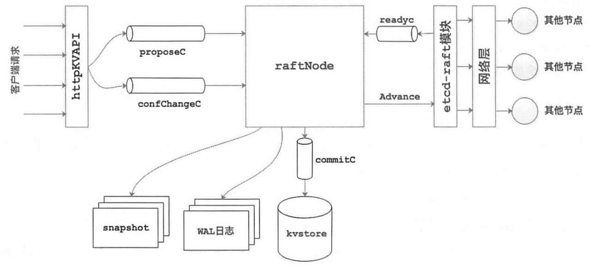
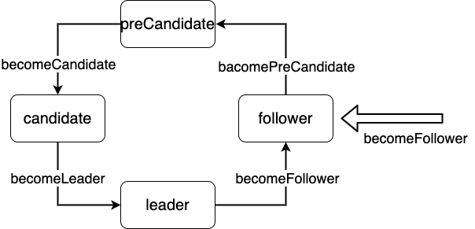

# etcd raft 源码走读（1）——选举

# 介绍

etcd 是一个经典的高可用、强一致性的分布式 KV 存储系统，其中利用 Raft 算法实现了各节点之间的强一致性。在 etcd 主库中没有直接实现 Raft 结构，而是将 Raft 具体实现作为一个依赖库拆到拓展库中。因此本文将按照 etcd-raft 设计和 etcd-raft 在 etcd 中的应用两部分来分别介绍。

这个系列我想至少分为 4 节，分别讲 选举、日志复制、故障恢复、日志压缩，可能还会有第 5 节讲 multi raft。这一节就来讲讲**选举机制。**



# 结构

首先来到 node.go 文件

```
// Node represents a node in a raft cluster.
type Node interface {
    // Tick increments the internal logical clock for the Node by a single tick. Election
    // timeouts and heartbeat timeouts are in units of ticks.
    Tick()
    // Campaign causes the Node to transition to candidate state and start campaigning to become leader.
    Campaign(ctx context.Context) error
    // Propose proposes that data be appended to the log. Note that proposals can be lost without
    // notice, therefore it is user's job to ensure proposal retries.
    Propose(ctx context.Context, data []byte) error
    // ProposeConfChange proposes a configuration change. Like any proposal, the
    // configuration change may be dropped with or without an error being
    // returned. In particular, configuration changes are dropped unless the
    // leader has certainty that there is no prior unapplied configuration
    // change in its log.
    //
    // The method accepts either a pb.ConfChange (deprecated) or pb.ConfChangeV2
    // message. The latter allows arbitrary configuration changes via joint
    // consensus, notably including replacing a voter. Passing a ConfChangeV2
    // message is only allowed if all Nodes participating in the cluster run a
    // version of this library aware of the V2 API. See pb.ConfChangeV2 for
    // usage details and semantics.
    ProposeConfChange(ctx context.Context, cc pb.ConfChangeI) error

    // Step advances the state machine using the given message. ctx.Err() will be returned, if any.
    Step(ctx context.Context, msg pb.Message) error

    // Ready returns a channel that returns the current point-in-time state.
    // Users of the Node must call Advance after retrieving the state returned by Ready (unless
    // async storage writes is enabled, in which case it should never be called).
    //
    // NOTE: No committed entries from the next Ready may be applied until all committed entries
    // and snapshots from the previous one have finished.
    Ready() <-chan Ready

    // Advance notifies the Node that the application has saved progress up to the last Ready.
    // It prepares the node to return the next available Ready.
    //
    // The application should generally call Advance after it applies the entries in last Ready.
    //
    // However, as an optimization, the application may call Advance while it is applying the
    // commands. For example. when the last Ready contains a snapshot, the application might take
    // a long time to apply the snapshot data. To continue receiving Ready without blocking raft
    // progress, it can call Advance before finishing applying the last ready.
    //
    // NOTE: Advance must not be called when using AsyncStorageWrites. Response messages from the
    // local append and apply threads take its place.
    Advance()
    // ApplyConfChange applies a config change (previously passed to
    // ProposeConfChange) to the node. This must be called whenever a config
    // change is observed in Ready.CommittedEntries, except when the app decides
    // to reject the configuration change (i.e. treats it as a noop instead), in
    // which case it must not be called.
    //
    // Returns an opaque non-nil ConfState protobuf which must be recorded in
    // snapshots.
    ApplyConfChange(cc pb.ConfChangeI) *pb.ConfState

    // TransferLeadership attempts to transfer leadership to the given transferee.
    TransferLeadership(ctx context.Context, lead, transferee uint64)

    // ForgetLeader forgets a follower's current leader, changing it to None. It
    // remains a leaderless follower in the current term, without campaigning.
    //
    // This is useful with PreVote+CheckQuorum, where followers will normally not
    // grant pre-votes if they've heard from the leader in the past election
    // timeout interval. Leaderless followers can grant pre-votes immediately, so
    // if a quorum of followers have strong reason to believe the leader is dead
    // (for example via a side-channel or external failure detector) and forget it
    // then they can elect a new leader immediately, without waiting out the
    // election timeout. They will also revert to normal followers if they hear
    // from the leader again, or transition to candidates on an election timeout.
    //
    // For example, consider a three-node cluster where 1 is the leader and 2+3
    // have just received a heartbeat from it. If 2 and 3 believe the leader has
    // now died (maybe they know that an orchestration system shut down 1's VM),
    // we can instruct 2 to forget the leader and 3 to campaign. 2 will then be
    // able to grant 3's pre-vote and elect 3 as leader immediately (normally 2
    // would reject the vote until an election timeout passes because it has heard
    // from the leader recently). However, 3 can not campaign unilaterally, a
    // quorum have to agree that the leader is dead, which avoids disrupting the
    // leader if individual nodes are wrong about it being dead.
    //
    // This does nothing with ReadOnlyLeaseBased, since it would allow a new
    // leader to be elected without the old leader knowing.
    ForgetLeader(ctx context.Context) error

    // ReadIndex request a read state. The read state will be set in the ready.
    // Read state has a read index. Once the application advances further than the read
    // index, any linearizable read requests issued before the read request can be
    // processed safely. The read state will have the same rctx attached.
    // Note that request can be lost without notice, therefore it is user's job
    // to ensure read index retries.
    ReadIndex(ctx context.Context, rctx []byte) error

    // Status returns the current status of the raft state machine.
    Status() Status
    // ReportUnreachable reports the given node is not reachable for the last send.
    ReportUnreachable(id uint64)
    // ReportSnapshot reports the status of the sent snapshot. The id is the raft ID of the follower
    // who is meant to receive the snapshot, and the status is SnapshotFinish or SnapshotFailure.
    // Calling ReportSnapshot with SnapshotFinish is a no-op. But, any failure in applying a
    // snapshot (for e.g., while streaming it from leader to follower), should be reported to the
    // leader with SnapshotFailure. When leader sends a snapshot to a follower, it pauses any raft
    // log probes until the follower can apply the snapshot and advance its state. If the follower
    // can't do that, for e.g., due to a crash, it could end up in a limbo, never getting any
    // updates from the leader. Therefore, it is crucial that the application ensures that any
    // failure in snapshot sending is caught and reported back to the leader; so it can resume raft
    // log probing in the follower.
    ReportSnapshot(id uint64, status SnapshotStatus)
    // Stop performs any necessary termination of the Node.
    Stop()
}

```

这个名为 node 的 interface 里记录了整体的流程，这一节我们只看跟选举有关的方法：

- Tick 实现了逻辑时钟，用于任期超时与心跳检测超时
- Campaign 用于节点转换成候选者，竞争去成为 leader
- TransferLeadership 将当前 node 的 leader 转换为目标节点
- ForgetLeader 可以帮助在识别到 leader 死掉之后快速选举出新 leader通常，Raft 的跟随者不会在短时间内接受来自领导者的选举票（Pre-vote），尤其是当跟随者刚收到领导者心跳时。然而，如果跟随者认为领导者已经死掉（例如，它们通过某种方式确认领导者的不可用），它们就可以通过 `ForgetLeader` 来忘记当前领导者。这种情况下，它们将不再依赖选举超时来等待新领导者的选举，而是可以立即发起新的领导者选举。
    - PreVote，发起预选举判断主节点是否正在挂掉而不是只是网络问题
    - CheckQuorum，判断是否达到要求的最小票额

在具体的接口实现中，分为 rawNode 和 node 两种结构体，其中前者是底层的，同步并发不安全的；后者是面向应用程序的，并发安全的，我们先从 rawNode 看起

## 初始化

```
// StartNode returns a new Node given configuration and a list of raft peers.
// It appends a ConfChangeAddNode entry for each given peer to the initial log.
//
// Peers must not be zero length; call RestartNode in that case.
func StartNode(c *Config, peers []Peer) Node {
    n := setupNode(c, peers)
    go n.run()
    return n
}

func setupNode(c *Config, peers []Peer) *node {
    if len(peers) == 0 {
       panic("no peers given; use RestartNode instead")
    }
    // 创建 rawNode
    rn, err := NewRawNode(c)
    if err != nil {
       panic(err)
    }
    // 启动 rawNode，成为 Follower，任期设置为 1 等等
    err = rn.Bootstrap(peers)
    if err != nil {
       c.Logger.Warningf("error occurred during starting a new node: %v", err)
    }

    n := newNode(rn)
    return &n
}

func NewRawNode(config *Config) (*RawNode, error) {
    r := newRaft(config)
    rn := &RawNode{
       raft: r,
    }
    rn.asyncStorageWrites = config.AsyncStorageWrites
    ss := r.softState()
    rn.prevSoftSt = &ss
    rn.prevHardSt = r.hardState()
    return rn, nil
}

func newRaft(c *Config) *raft {
    if err := c.validate(); err != nil {
       panic(err.Error())
    }
    raftlog := newLogWithSize(c.Storage, c.Logger, entryEncodingSize(c.MaxCommittedSizePerReady))
    hs, cs, err := c.Storage.InitialState()
    if err != nil {
       panic(err) //TODO(bdarnell)}

    r := &raft{
       id:                          c.ID,
       lead:None,
       isLearner:                   false,
       raftLog:                     raftlog,
       maxMsgSize:                  entryEncodingSize(c.MaxSizePerMsg),
       maxUncommittedSize:          entryPayloadSize(c.MaxUncommittedEntriesSize),
       trk:                         tracker.MakeProgressTracker(c.MaxInflightMsgs, c.MaxInflightBytes),
       electionTimeout:             c.ElectionTick,
       heartbeatTimeout:            c.HeartbeatTick,
       logger:                      c.Logger,
       checkQuorum:                 c.CheckQuorum,
       preVote:                     c.PreVote,
       readOnly:                    newReadOnly(c.ReadOnlyOption),
       disableProposalForwarding:   c.DisableProposalForwarding,
       disableConfChangeValidation: c.DisableConfChangeValidation,
       stepDownOnRemoval:           c.StepDownOnRemoval,
       traceLogger:                 c.TraceLogger,
    }

    traceInitState(r)

    lastID := r.raftLog.lastEntryID()
    cfg, trk, err := confchange.Restore(confchange.Changer{
       Tracker:   r.trk,
       LastIndex: lastID.index,
    }, cs)
    if err != nil {
       panic(err)
    }
    assertConfStatesEquivalent(r.logger, cs, r.switchToConfig(cfg, trk))

    if !IsEmptyHardState(hs) {
       r.loadState(hs)
    }
    if c.Applied > 0 {
       raftlog.appliedTo(c.Applied, 0 /* size */)
    }
    r.becomeFollower(r.Term,None)

    var nodesStrs []string
    for _, n := range r.trk.VoterNodes() {
       nodesStrs = append(nodesStrs, fmt.Sprintf("%x", n))
    }

    //TODO(pav-kv): it should be ok to simply print %+v for lastID.r.logger.Infof("newRaft %x [peers: [%s], term: %d, commit: %d, applied: %d, lastindex: %d, lastterm: %d]",
       r.id, strings.Join(nodesStrs, ","), r.Term, r.raftLog.committed, r.raftLog.applied, lastID.index, lastID.term)
    return r
}

// 应用层 Node 的初始化
func newNode(rn *RawNode) node {
    return node{
       propc:      make(chan msgWithResult),
       recvc:      make(chan pb.Message),
       confc:      make(chan pb.ConfChangeV2),
       confstatec: make(chan pb.ConfState),
       readyc:     make(chan Ready),
       advancec:   make(chan struct{}),
       // make tickc a buffered chan, so raft node can buffer some ticks when the node
       // is busy processing raft messages. Raft node will resume process buffered
       // ticks when it becomes idle.
       tickc:  make(chan struct{}, 128),
       done:   make(chan struct{}),
       stop:   make(chan struct{}),
       status: make(chan chan Status),
       rn:     rn,
    }
}

```

调用 goroutine 启动 run 方法，主要都是使用 channel 进行同步地获取新的 msg 然后解析

```
func (n *node) run() {
    var propc chan msgWithResult
    var readyc chan Ready
    var advancec chan struct{}
    var rd Ready

    r := n.rn.raft

    lead :=Nonefor {
       if advancec == nil && n.rn.HasReady() {
          // Populate a Ready. Note that this Ready is not guaranteed to
          // actually be handled. We will arm readyc, but there's no guarantee
          // that we will actually send on it. It's possible that we will
          // service another channel instead, loop around, and then populate
          // the Ready again. We could instead force the previous Ready to be
          // handled first, but it's generally good to emit larger Readys plus
          // it simplifies testing (by emitting less frequently and more
          // predictably).
          rd = n.rn.readyWithoutAccept()
          readyc = n.readyc
       }

       if lead != r.lead {
          if r.hasLeader() {
             if lead ==None{
                r.logger.Infof("raft.node: %x elected leader %x at term %d", r.id, r.lead, r.Term)
             } else {
                r.logger.Infof("raft.node: %x changed leader from %x to %x at term %d", r.id, lead, r.lead, r.Term)
             }
             propc = n.propc
          } else {
             r.logger.Infof("raft.node: %x lost leader %x at term %d", r.id, lead, r.Term)
             propc = nil
          }
          lead = r.lead
       }

       select {
       //TODO: maybe buffer the config propose if there exists one (the way// described in raft dissertation)
       // Currently it is dropped in Step silently.
       case pm := <-propc:
          m := pm.m
          m.From = r.id
          err := r.Step(m)
          if pm.result != nil {
             pm.result <- err
             close(pm.result)
          }
       case m := <-n.recvc:
          if IsResponseMsg(m.Type) && !IsLocalMsgTarget(m.From) && r.trk.Progress[m.From] == nil {
             // Filter out response message from unknown From.
             break
          }
          r.Step(m)
       case cc := <-n.confc:
          _, okBefore := r.trk.Progress[r.id]
          cs := r.applyConfChange(cc)
          // If the node was removed, block incoming proposals. Note that we
          // only do this if the node was in the config before. Nodes may be
          // a member of the group without knowing this (when they're catching
          // up on the log and don't have the latest config) and we don't want
          // to block the proposal channel in that case.
          //
          // NB: propc is reset when the leader changes, which, if we learn
          // about it, sort of implies that we got readded, maybe? This isn't
          // very sound and likely has bugs.
          if _, okAfter := r.trk.Progress[r.id]; okBefore && !okAfter {
             var found bool
             for _, sl := range [][]uint64{cs.Voters, cs.VotersOutgoing} {
                for _, id := range sl {
                   if id == r.id {
                      found = true
                      break
                   }
                }
                if found {
                   break
                }
             }
             if !found {
                propc = nil
             }
          }
          select {
          case n.confstatec <- cs:
          case <-n.done:
          }
       case <-n.tickc:
          n.rn.Tick()
       case readyc <- rd:
          n.rn.acceptReady(rd)
          if !n.rn.asyncStorageWrites {
             advancec = n.advancec
          } else {
             rd = Ready{}
          }
          readyc = nil
       case <-advancec:
          n.rn.Advance(rd)
          rd = Ready{}
          advancec = nil
       case c := <-n.status:
          c <- getStatus(r)
       case <-n.stop:
          close(n.done)
          return
       }
    }
}

```

根据不同的时间类型调用 raft 层 step 方法进行处理

```
select {
//TODO: maybe buffer the config propose if there exists one (the way
// described in raft dissertation)
// Currently it is dropped in Step silently.
case pm := <-propc:

case m := <-n.recvc:

case cc := <-n.confc:

case <-n.tickc:

case readyc <- rd:

case <-advancec:

case c := <-n.status:

case <-n.stop:

}

```

### rawNode

rawNode

```
// RawNode is a thread-unsafe Node.
// The methods of this struct correspond to the methods of Node and are described
// more fully there.
type RawNode struct {
    raft               *raft
    asyncStorageWrites bool

    // Mutable fields.
    prevSoftSt     *SoftState
    prevHardSt     pb.HardState
    stepsOnAdvance []pb.Message
}

```

raft

```
type raft struct {
    id uint64

    Term uint64
    Vote uint64

    readStates []ReadState

    // the log
    raftLog *raftLog

    maxMsgSize         entryEncodingSize
    maxUncommittedSize entryPayloadSize

    trk tracker.ProgressTracker

    state StateType

    // isLearner is true if the local raft node is a learner.
    isLearner bool

    // msgs contains the list of messages that should be sent out immediately to
    // other nodes.
    //
    // Messages in this list must target other nodes.
    msgs []pb.Message
    // msgsAfterAppend contains the list of messages that should be sent after
    // the accumulated unstable state (e.g. term, vote, []entry, and snapshot)
    // has been persisted to durable storage. This includes waiting for any
    // unstable state that is already in the process of being persisted (i.e.
    // has already been handed out in a prior Ready struct) to complete.
    //
    // Messages in this list may target other nodes or may target this node.
    //
    // Messages in this list have the type MsgAppResp, MsgVoteResp, or
    // MsgPreVoteResp. See the comment in raft.send for details.
    msgsAfterAppend []pb.Message

    // the leader id
    lead uint64
    // leadTransferee is id of the leader transfer target when its value is not zero.
    // Follow the procedure defined in raft thesis 3.10.
    leadTransferee uint64
    // Only one conf change may be pending (in the log, but not yet
    // applied) at a time. This is enforced via pendingConfIndex, which
    // is set to a value >= the log index of the latest pending
    // configuration change (if any). Config changes are only allowed to
    // be proposed if the leader's applied index is greater than this
    // value.
    pendingConfIndex uint64
    // disableConfChangeValidation is Config.DisableConfChangeValidation,
    // see there for details.
    disableConfChangeValidation bool
    // an estimate of the size of the uncommitted tail of the Raft log. Used to
    // prevent unbounded log growth. Only maintained by the leader. Reset on
    // term changes.
    uncommittedSize entryPayloadSize

    readOnly *readOnly

    // number of ticks since it reached last electionTimeout when it is leader
    // or candidate.
    // number of ticks since it reached last electionTimeout or received a
    // valid message from current leader when it is a follower.
    electionElapsed int

    // number of ticks since it reached last heartbeatTimeout.
    // only leader keeps heartbeatElapsed.
    heartbeatElapsed int

    checkQuorum bool
    preVote     bool

    heartbeatTimeout int
    electionTimeout  int
    // randomizedElectionTimeout is a random number between
    // [electiontimeout, 2 * electiontimeout - 1]. It gets reset
    // when raft changes its state to follower or candidate.
    randomizedElectionTimeout int
    disableProposalForwarding bool
    stepDownOnRemoval         bool

    tick func()
    step stepFunc

    logger Logger

    // pendingReadIndexMessages is used to store messages of type MsgReadIndex
    // that can't be answered as new leader didn't committed any log in
    // current term. Those will be handled as fast as first log is committed in
    // current term.
    pendingReadIndexMessages []pb.Message

    traceLogger TraceLogger
}

```

先来看第一个方法：Tick

```
// Tick advances the internal logical clock by a single tick.
func (rn *RawNode) Tick() {
    rn.raft.tick()
}

```

直接调用了 raft 结构体的 tick 方法，tick 是一个 func() 类型，只会有两种实现：`r.tickHeartbeat` 和 `r.tickElection`，分别是心跳检测和超时选举

当前 raft 节点的 electionElapsed（上次选举超时之后收到的 tick 数）+1

```
// tickElection is run by followers and candidates after r.electionTimeout.
func (r *raft) tickElection() {
    r.electionElapsed++

    if r.promotable() && r.pastElectionTimeout() {
       r.electionElapsed = 0
       if err := r.Step(pb.Message{From: r.id, Type: pb.MsgHup}); err != nil {
          r.logger.Debugf("error occurred during election: %v", err)
       }
    }
}

```

如果当前节点是可晋升的

```
func (r *raft) promotable() bool {
    pr := r.trk.Progress[r.id]
    return pr != nil && !pr.IsLearner && !r.raftLog.hasNextOrInProgressSnapshot()
}

```

而且 electionElapsed >=选举超时的随机时间

```
// pastElectionTimeout returns true if r.electionElapsed is greater
// than or equal to the randomized election timeout in
// [electiontimeout, 2 * electiontimeout - 1].
func (r *raft) pastElectionTimeout() bool {
    return r.electionElapsed >= r.randomizedElectionTimeout
}

```

那么则重置 electionElapsed 并通过 step 方法成为 candidate

```
func (r *raft) Step(m pb.Message) error {
    traceReceiveMessage(r, &m)

    // Handle the message term, which may result in our stepping down to a follower.
    switch {
    case m.Term == 0:
       // local message
    case m.Term > r.Term:
       if m.Type == pb.MsgVote|| m.Type == pb.MsgPreVote{
          force := bytes.Equal(m.Context, []byte(campaignTransfer))
          inLease := r.checkQuorum && r.lead !=None&& r.electionElapsed < r.electionTimeout
          if !force && inLease {
             // If a server receives a RequestVote request within the minimum election timeout
             // of hearing from a current leader, it does not update its term or grant its vote
             last := r.raftLog.lastEntryID()
             //TODO(pav-kv): it should be ok to simply print the %+v of the lastEntryID.r.logger.Infof("%x [logterm: %d, index: %d, vote: %x] ignored %s from %x [logterm: %d, index: %d] at term %d: lease is not expired (remaining ticks: %d)",
                r.id, last.term, last.index, r.Vote, m.Type, m.From, m.LogTerm, m.Index, r.Term, r.electionTimeout-r.electionElapsed)
             return nil
          }
       }
       switch {
       case m.Type == pb.MsgPreVote:
          // Never change our term in response to a PreVote
       case m.Type == pb.MsgPreVoteResp&& !m.Reject:
          // We send pre-vote requests with a term in our future. If the
          // pre-vote is granted, we will increment our term when we get a
          // quorum. If it is not, the term comes from the node that
          // rejected our vote so we should become a follower at the new
          // term.
       default:
          r.logger.Infof("%x [term: %d] received a %s message with higher term from %x [term: %d]",
             r.id, r.Term, m.Type, m.From, m.Term)
          if m.Type == pb.MsgApp|| m.Type == pb.MsgHeartbeat|| m.Type == pb.MsgSnap{
             r.becomeFollower(m.Term, m.From)
          } else {
             r.becomeFollower(m.Term,None)
          }
       }

    case m.Term < r.Term:
       if (r.checkQuorum || r.preVote) && (m.Type == pb.MsgHeartbeat|| m.Type == pb.MsgApp) {
          // We have received messages from a leader at a lower term. It is possible
          // that these messages were simply delayed in the network, but this could
          // also mean that this node has advanced its term number during a network
          // partition, and it is now unable to either win an election or to rejoin
          // the majority on the old term. If checkQuorum is false, this will be
          // handled by incrementing term numbers in response to MsgVote with a
          // higher term, but if checkQuorum is true we may not advance the term on
          // MsgVote and must generate other messages to advance the term. The net
          // result of these two features is to minimize the disruption caused by
          // nodes that have been removed from the cluster's configuration: a
          // removed node will send MsgVotes (or MsgPreVotes) which will be ignored,
          // but it will not receive MsgApp or MsgHeartbeat, so it will not create
          // disruptive term increases, by notifying leader of this node's activeness.
          // The above comments also true for Pre-Vote
          //
          // When follower gets isolated, it soon starts an election ending
          // up with a higher term than leader, although it won't receive enough
          // votes to win the election. When it regains connectivity, this response
          // with "pb.MsgAppResp" of higher term would force leader to step down.
          // However, this disruption is inevitable to free this stuck node with
          // fresh election. This can be prevented with Pre-Vote phase.
          r.send(pb.Message{To: m.From, Type: pb.MsgAppResp})
       } else if m.Type == pb.MsgPreVote{
          // Before Pre-Vote enable, there may have candidate with higher term,
          // but less log. After update to Pre-Vote, the cluster may deadlock if
          // we drop messages with a lower term.
          last := r.raftLog.lastEntryID()
          //TODO(pav-kv): it should be ok to simply print %+v of the lastEntryID.r.logger.Infof("%x [logterm: %d, index: %d, vote: %x] rejected %s from %x [logterm: %d, index: %d] at term %d",
             r.id, last.term, last.index, r.Vote, m.Type, m.From, m.LogTerm, m.Index, r.Term)
          r.send(pb.Message{To: m.From, Term: r.Term, Type: pb.MsgPreVoteResp, Reject: true})
       } else if m.Type == pb.MsgStorageAppendResp{
          if m.Index != 0 {
             // Don't consider the appended log entries to be stable because
             // they may have been overwritten in the unstable log during a
             // later term. See the comment in newStorageAppendResp for more
             // about this race.
             r.logger.Infof("%x [term: %d] ignored entry appends from a %s message with lower term [term: %d]",
                r.id, r.Term, m.Type, m.Term)
          }
          if m.Snapshot != nil {
             // Even if the snapshot applied under a different term, its
             // application is still valid. Snapshots carry committed
             // (term-independent) state.
             r.appliedSnap(m.Snapshot)
          }
       } else {
          // ignore other cases
          r.logger.Infof("%x [term: %d] ignored a %s message with lower term from %x [term: %d]",
             r.id, r.Term, m.Type, m.From, m.Term)
       }
       return nil
    }

    switch m.Type {
    case pb.MsgHup:
       if r.preVote {
          r.hup(campaignPreElection)
       } else {
          r.hup(campaignElection)
       }

    case pb.MsgStorageAppendResp:
       if m.Index != 0 {
          r.raftLog.stableTo(entryID{term: m.LogTerm, index: m.Index})
       }
       if m.Snapshot != nil {
          r.appliedSnap(m.Snapshot)
       }

    case pb.MsgStorageApplyResp:
       if len(m.Entries) > 0 {
          index := m.Entries[len(m.Entries)-1].Index
          r.appliedTo(index, entsSize(m.Entries))
          r.reduceUncommittedSize(payloadsSize(m.Entries))
       }

    case pb.MsgVote, pb.MsgPreVote:
       // We can vote if this is a repeat of a vote we've already cast...
       canVote := r.Vote == m.From ||
          // ...we haven't voted and we don't think there's a leader yet in this term...
          (r.Vote ==None&& r.lead ==None) ||
          // ...or this is a PreVote for a future term...
          (m.Type == pb.MsgPreVote&& m.Term > r.Term)
       // ...and we believe the candidate is up to date.
       lastID := r.raftLog.lastEntryID()
       candLastID := entryID{term: m.LogTerm, index: m.Index}
       if canVote && r.raftLog.isUpToDate(candLastID) {
          // Note: it turns out that that learners must be allowed to cast votes.
          // This seems counter- intuitive but is necessary in the situation in which
          // a learner has been promoted (i.e. is now a voter) but has not learned
          // about this yet.
          // For example, consider a group in which id=1 is a learner and id=2 and
          // id=3 are voters. A configuration change promoting 1 can be committed on
          // the quorum `{2,3}` without the config change being appended to the
          // learner's log. If the leader (say 2) fails, there are de facto two
          // voters remaining. Only 3 can win an election (due to its log containing
          // all committed entries), but to do so it will need 1 to vote. But 1
          // considers itself a learner and will continue to do so until 3 has
          // stepped up as leader, replicates the conf change to 1, and 1 applies it.
          // Ultimately, by receiving a request to vote, the learner realizes that
          // the candidate believes it to be a voter, and that it should act
          // accordingly. The candidate's config may be stale, too; but in that case
          // it won't win the election, at least in the absence of the bug discussed
          // in:
          // https://github.com/etcd-io/etcd/issues/7625#issuecomment-488798263.
          r.logger.Infof("%x [logterm: %d, index: %d, vote: %x] cast %s for %x [logterm: %d, index: %d] at term %d",
             r.id, lastID.term, lastID.index, r.Vote, m.Type, m.From, candLastID.term, candLastID.index, r.Term)
          // When responding to Msg{Pre,}Vote messages we include the term
          // from the message, not the local term. To see why, consider the
          // case where a single node was previously partitioned away and
          // it's local term is now out of date. If we include the local term
          // (recall that for pre-votes we don't update the local term), the
          // (pre-)campaigning node on the other end will proceed to ignore
          // the message (it ignores all out of date messages).
          // The term in the original message and current local term are the
          // same in the case of regular votes, but different for pre-votes.
          r.send(pb.Message{To: m.From, Term: m.Term, Type: voteRespMsgType(m.Type)})
          if m.Type == pb.MsgVote{
             // Only record real votes.
             r.electionElapsed = 0
             r.Vote = m.From
          }
       } else {
          r.logger.Infof("%x [logterm: %d, index: %d, vote: %x] rejected %s from %x [logterm: %d, index: %d] at term %d",
             r.id, lastID.term, lastID.index, r.Vote, m.Type, m.From, candLastID.term, candLastID.index, r.Term)
          r.send(pb.Message{To: m.From, Term: r.Term, Type: voteRespMsgType(m.Type), Reject: true})
       }

    default:
       err := r.step(r, m)
       if err != nil {
          return err
       }
    }
    return nil
}

```

以上的 step 方法太长了，其实我们需要的成为 candidate 只有以下这部分

```
switch m.Type {
case pb.MsgHup:
    if r.preVote {
       r.hup(campaignPreElection)
    } else {
       r.hup(campaignElection)
    }
    //...

```

在此通过 r.hup 方法进行预投票或投票

```
func (r *raft) hup(t CampaignType) {
    if r.state ==StateLeader{
       r.logger.Debugf("%x ignoring MsgHup because already leader", r.id)
       return
    }

    if !r.promotable() {
       r.logger.Warningf("%x is unpromotable and can not campaign", r.id)
       return
    }
    if r.hasUnappliedConfChanges() {
       r.logger.Warningf("%x cannot campaign at term %d since there are still pending configuration changes to apply", r.id, r.Term)
       return
    }

    r.logger.Infof("%x is starting a new election at term %d", r.id, r.Term)
    r.campaign(t)
}

```

如果满足一系列条件则通过 campaign 方法进行竞争选举

```
// campaign transitions the raft instance to candidate state. This must only be
// called after verifying that this is a legitimate transition.
func (r *raft) campaign(t CampaignType) {
    if !r.promotable() {
       // This path should not be hit (callers are supposed to check), but
       // better safe than sorry.
       r.logger.Warningf("%x is unpromotable; campaign() should have been called", r.id)
    }
    var term uint64
    var voteMsg pb.MessageType
    if t ==campaignPreElection{
       r.becomePreCandidate()
       voteMsg = pb.MsgPreVote// PreVote RPCs are sent for the next term before we've incremented r.Term.
       term = r.Term + 1
    } else {
       r.becomeCandidate()
       voteMsg = pb.MsgVoteterm = r.Term
    }
    var ids []uint64
    {
       idMap := r.trk.Voters.IDs()
       ids = make([]uint64, 0, len(idMap))
       for id := range idMap {
          ids = append(ids, id)
       }
       slices.Sort(ids)
    }
    for _, id := range ids {
       if id == r.id {
          // The candidate votes for itself and should account for this self
          // vote once the vote has been durably persisted (since it doesn't
          // send a MsgVote to itself). This response message will be added to
          // msgsAfterAppend and delivered back to this node after the vote
          // has been written to stable storage.
          r.send(pb.Message{To: id, Term: term, Type: voteRespMsgType(voteMsg)})
          continue
       }
       //TODO(pav-kv): it should be ok to simply print %+v for the lastEntryID.last := r.raftLog.lastEntryID()
       r.logger.Infof("%x [logterm: %d, index: %d] sent %s request to %x at term %d",
          r.id, last.term, last.index, voteMsg, id, r.Term)

       var ctx []byte
       if t ==campaignTransfer{
          ctx = []byte(t)
       }
       r.send(pb.Message{To: id, Term: term, Type: voteMsg, Index: last.index, LogTerm: last.term, Context: ctx})
    }
}

```

值得一提的是引入了**预候选者**的角色，如果接收到了预投票并胜出则进入预选者身份，否则直接进入 leader 身份

```
case myVoteRespType:
    gr, rj, res := r.poll(m.From, m.Type, !m.Reject)
    r.logger.Infof("%x has received %d %s votes and %d vote rejections", r.id, gr, m.Type, rj)
    switch res {
    case quorum.VoteWon:
       if r.state ==StatePreCandidate{
          r.campaign(campaignElection)
       } else {
          r.becomeLeader()
          r.bcastAppend()
       }
    case quorum.VoteLost:
       // pb.MsgPreVoteResp contains future term of pre-candidate
       // m.Term > r.Term; reuse r.Term
       r.becomeFollower(r.Term,None)
    }

```

### send

```
// send schedules persisting state to a stable storage and AFTER that
// sending the message (as part of next Ready message processing).
func (r *raft) send(m pb.Message) {
    if m.From ==None{
       m.From = r.id
    }
    if m.Type == pb.MsgVote|| m.Type == pb.MsgVoteResp|| m.Type == pb.MsgPreVote|| m.Type == pb.MsgPreVoteResp{
       if m.Term == 0 {
          // All {pre-,}campaign messages need to have the term set when
          // sending.
          // - MsgVote: m.Term is the term the node is campaigning for,
          //   non-zero as we increment the term when campaigning.
          // - MsgVoteResp: m.Term is the new r.Term if the MsgVote was
          //   granted, non-zero for the same reason MsgVote is
          // - MsgPreVote: m.Term is the term the node will campaign,
          //   non-zero as we use m.Term to indicate the next term we'll be
          //   campaigning for
          // - MsgPreVoteResp: m.Term is the term received in the original
          //   MsgPreVote if the pre-vote was granted, non-zero for the
          //   same reasons MsgPreVote is
          r.logger.Panicf("term should be set when sending %s", m.Type)
       }
    } else {
       if m.Term != 0 {
          r.logger.Panicf("term should not be set when sending %s (was %d)", m.Type, m.Term)
       }
       // do not attach term to MsgProp, MsgReadIndex
       // proposals are a way to forward to the leader and
       // should be treated as local message.
       // MsgReadIndex is also forwarded to leader.
       if m.Type != pb.MsgProp&& m.Type != pb.MsgReadIndex{
          m.Term = r.Term
       }
    }
    if m.Type == pb.MsgAppResp|| m.Type == pb.MsgVoteResp|| m.Type == pb.MsgPreVoteResp{
       // If async storage writes are enabled, messages added to the msgs slice
       // are allowed to be sent out before unstable state (e.g. log entry
       // writes and election votes) have been durably synced to the local
       // disk.
       //
       // For most message types, this is not an issue. However, response
       // messages that relate to "voting" on either leader election or log
       // appends require durability before they can be sent. It would be
       // incorrect to publish a vote in an election before that vote has been
       // synced to stable storage locally. Similarly, it would be incorrect to
       // acknowledge a log append to the leader before that entry has been
       // synced to stable storage locally.
       //
       // Per the Raft thesis, section 3.8 Persisted state and server restarts:
       //
       // > Raft servers must persist enough information to stable storage to
       // > survive server restarts safely. In particular, each server persists
       // > its current term and vote; this is necessary to prevent the server
       // > from voting twice in the same term or replacing log entries from a
       // > newer leader with those from a deposed leader. Each server also
       // > persists new log entries before they are counted towards the entries’
       // > commitment; this prevents committed entries from being lost or
       // > “uncommitted” when servers restart
       //
       // To enforce this durability requirement, these response messages are
       // queued to be sent out as soon as the current collection of unstable
       // state (the state that the response message was predicated upon) has
       // been durably persisted. This unstable state may have already been
       // passed to a Ready struct whose persistence is in progress or may be
       // waiting for the next Ready struct to begin being written to Storage.
       // These messages must wait for all of this state to be durable before
       // being published.
       //
       // Rejected responses (m.Reject == true) present an interesting case
       // where the durability requirement is less unambiguous. A rejection may
       // be predicated upon unstable state. For instance, a node may reject a
       // vote for one peer because it has already begun syncing its vote for
       // another peer. Or it may reject a vote from one peer because it has
       // unstable log entries that indicate that the peer is behind on its
       // log. In these cases, it is likely safe to send out the rejection
       // response immediately without compromising safety in the presence of a
       // server restart. However, because these rejections are rare and
       // because the safety of such behavior has not been formally verified,
       // we err on the side of safety and omit a `&& !m.Reject` condition
       // above.
       r.msgsAfterAppend = append(r.msgsAfterAppend, m)
       traceSendMessage(r, &m)
    } else {
       if m.To == r.id {
          r.logger.Panicf("message should not be self-addressed when sending %s", m.Type)
       }
       r.msgs = append(r.msgs, m)
       traceSendMessage(r, &m)
    }
}

```

前面都是条件判断，核心流程在最后：

如果消息类型是投票或者预投票则通过 msgsAfterAppend 这个 channel 进行

msgs 和 msgsAfterAppend 的区别在于 msgs 会立即发送，而 msgsAfterAppend 需要在不稳定状态（如term, vote, []entry, and snapshot）持久化之后才发送

```
    if m.Type == pb.MsgAppResp|| m.Type == pb.MsgVoteResp|| m.Type == pb.MsgPreVoteResp{
       r.msgsAfterAppend = append(r.msgsAfterAppend, m)
       traceSendMessage(r, &m)
    } else {
       if m.To == r.id {
          r.logger.Panicf("message should not be self-addressed when sending %s", m.Type)
       }
       r.msgs = append(r.msgs, m)
       traceSendMessage(r, &m)
    }

    // msgs contains the list of messages that should be sent out immediately to
    // other nodes.
    //
    // Messages in this list must target other nodes.
    msgs []pb.Message
    // msgsAfterAppend contains the list of messages that should be sent after
    // the accumulated unstable state (e.g. term, vote, []entry, and snapshot)
    // has been persisted to durable storage. This includes waiting for any
    // unstable state that is already in the process of being persisted (i.e.
    // has already been handed out in a prior Ready struct) to complete.
    //
    // Messages in this list may target other nodes or may target this node.
    //
    // Messages in this list have the type MsgAppResp, MsgVoteResp, or
    // MsgPreVoteResp. See the comment in raft.send for details.
    msgsAfterAppend []pb.Message

```

在 rawnode 使用以下函数进行 ready 之后的发送

```
// readyWithoutAccept returns a Ready. This is a read-only operation, i.e. there
// is no obligation that the Ready must be handled.
func (rn *RawNode) readyWithoutAccept() Ready {
    r := rn.raft

    rd := Ready{
       Entries:          r.raftLog.nextUnstableEnts(),
       CommittedEntries: r.raftLog.nextCommittedEnts(rn.applyUnstableEntries()),
       Messages:         r.msgs,
    }
    if softSt := r.softState(); !softSt.equal(rn.prevSoftSt) {
       // Allocate only when SoftState changes.
       escapingSoftSt := softSt
       rd.SoftState = &escapingSoftSt
    }
    if hardSt := r.hardState(); !isHardStateEqual(hardSt, rn.prevHardSt) {
       rd.HardState = hardSt
    }
    if r.raftLog.hasNextUnstableSnapshot() {
       rd.Snapshot = *r.raftLog.nextUnstableSnapshot()
    }
    if len(r.readStates) != 0 {
       rd.ReadStates = r.readStates
    }
    rd.MustSync = MustSync(r.hardState(), rn.prevHardSt, len(rd.Entries))

    if rn.asyncStorageWrites {
       // If async storage writes are enabled, enqueue messages to
       // local storage threads, where applicable.
       if needStorageAppendMsg(r, rd) {
          m := newStorageAppendMsg(r, rd)
          rd.Messages = append(rd.Messages, m)
       }
       if needStorageApplyMsg(rd) {
          m := newStorageApplyMsg(r, rd)
          rd.Messages = append(rd.Messages, m)
       }
    } else {
       // If async storage writes are disabled, immediately enqueue
       // msgsAfterAppend to be sent out. The Ready struct contract
       // mandates that Messages cannot be sent until after Entries
       // are written to stable storage.
       for _, m := range r.msgsAfterAppend {
          if m.To != r.id {
             rd.Messages = append(rd.Messages, m)
          }
       }
    }

    return rd
}

```

最终消息都被存放在当前节点的 rd.Message 中等待转发，etcd-raft 库中没有实现网络传输相关逻辑，但是在 rafttest 以及 etcd 的 raftexample 中可以看到有封装的相关示例：

```
for _, m := range rd.Messages {
    if raft.IsLocalMsgTarget(m.To) {
       if !n.Config.AsyncStorageWrites {
          panic("unexpected local msg target")
       }
       switch m.Type {
       case raftpb.MsgStorageAppend:
          n.AppendWork = append(n.AppendWork, m)
       case raftpb.MsgStorageApply:
          n.ApplyWork = append(n.ApplyWork, m)
       default:
          panic(fmt.Sprintf("unexpected message type %s", m.Type))
       }
    } else {
       env.Messages = append(env.Messages, m)
    }
}

```

## Follower

所有节点的初始状态都是 follower，step 是一个 stepFollower 方法，tick 也是选举超时

```
func (r *raft) becomeFollower(term uint64, lead uint64) {
    r.step = stepFollower
    r.reset(term)
    r.tick = r.tickElection
    r.lead = lead
    r.state =StateFollowerr.logger.Infof("%x became follower at term %d", r.id, r.Term)

    traceBecomeFollower(r)
}

```

```
func stepFollower(r *raft, m pb.Message) error {
    switch m.Type {
    case pb.MsgProp:
       if r.lead ==None{
          r.logger.Infof("%x no leader at term %d; dropping proposal", r.id, r.Term)
          return ErrProposalDropped
       } else if r.disableProposalForwarding {
          r.logger.Infof("%x not forwarding to leader %x at term %d; dropping proposal", r.id, r.lead, r.Term)
          return ErrProposalDropped
       }
       m.To = r.lead
       r.send(m)
    case pb.MsgApp:
       r.electionElapsed = 0
       r.lead = m.From
       r.handleAppendEntries(m)
    case pb.MsgHeartbeat:
       r.electionElapsed = 0
       r.lead = m.From
       r.handleHeartbeat(m)
    case pb.MsgSnap:
       r.electionElapsed = 0
       r.lead = m.From
       r.handleSnapshot(m)
    case pb.MsgTransferLeader:
       if r.lead ==None{
          r.logger.Infof("%x no leader at term %d; dropping leader transfer msg", r.id, r.Term)
          return nil
       }
       m.To = r.lead
       r.send(m)
    case pb.MsgForgetLeader:
       if r.readOnly.option ==ReadOnlyLeaseBased{
          r.logger.Error("ignoring MsgForgetLeader due to ReadOnlyLeaseBased")
          return nil
       }
       if r.lead !=None{
          r.logger.Infof("%x forgetting leader %x at term %d", r.id, r.lead, r.Term)
          r.lead =None}
    case pb.MsgTimeoutNow:
       r.logger.Infof("%x [term %d] received MsgTimeoutNow from %x and starts an election to get leadership.", r.id, r.Term, m.From)
       // Leadership transfers never use pre-vote even if r.preVote is true; we
       // know we are not recovering from a partition so there is no need for the
       // extra round trip.
       r.hup(campaignTransfer)
    case pb.MsgReadIndex:
       if r.lead ==None{
          r.logger.Infof("%x no leader at term %d; dropping index reading msg", r.id, r.Term)
          return nil
       }
       m.To = r.lead
       r.send(m)
    case pb.MsgReadIndexResp:
       if len(m.Entries) != 1 {
          r.logger.Errorf("%x invalid format of MsgReadIndexResp from %x, entries count: %d", r.id, m.From, len(m.Entries))
          return nil
       }
       r.readStates = append(r.readStates, ReadState{Index: m.Index, RequestCtx: m.Entries[0].Data})
    }
    return nil
}

```

## PreCandidate

为了防止在分区的情况下，某个split的Follower的Term数值变得很大的场景，引入了PreCandidate


```
func (r *raft) becomePreCandidate() {
    //TODO(xiangli) remove the panic when the raft implementation is stableif r.state ==StateLeader{
       panic("invalid transition [leader -> pre-candidate]")
    }
    // Becoming a pre-candidate changes our step functions and state,
    // but doesn't change anything else. In particular it does not increase
    // r.Term or change r.Vote.
    r.step = stepCandidate
    r.trk.ResetVotes()
    r.tick = r.tickElection
    r.lead =Noner.state =StatePreCandidater.logger.Infof("%x became pre-candidate at term %d", r.id, r.Term)
}

// stepCandidate is shared by StateCandidate and StatePreCandidate; the difference is
// whether they respond to MsgVoteResp or MsgPreVoteResp.
func stepCandidate(r *raft, m pb.Message) error {
    // Only handle vote responses corresponding to our candidacy (while in
    // StateCandidate, we may get stale MsgPreVoteResp messages in this term from
    // our pre-candidate state).
    var myVoteRespType pb.MessageType
    if r.state ==StatePreCandidate{
       myVoteRespType = pb.MsgPreVoteResp} else {
       myVoteRespType = pb.MsgVoteResp}
    switch m.Type {
    case pb.MsgProp:
       r.logger.Infof("%x no leader at term %d; dropping proposal", r.id, r.Term)
       return ErrProposalDropped
    case pb.MsgApp:
       r.becomeFollower(m.Term, m.From) // always m.Term == r.Term
       r.handleAppendEntries(m)
    case pb.MsgHeartbeat:
       r.becomeFollower(m.Term, m.From) // always m.Term == r.Term
       r.handleHeartbeat(m)
    case pb.MsgSnap:
       r.becomeFollower(m.Term, m.From) // always m.Term == r.Term
       r.handleSnapshot(m)
    case myVoteRespType:
       gr, rj, res := r.poll(m.From, m.Type, !m.Reject)
       r.logger.Infof("%x has received %d %s votes and %d vote rejections", r.id, gr, m.Type, rj)
       switch res {
       case quorum.VoteWon:
          if r.state ==StatePreCandidate{
             r.campaign(campaignElection)
          } else {
             r.becomeLeader()
             r.bcastAppend()
          }
       case quorum.VoteLost:
          // pb.MsgPreVoteResp contains future term of pre-candidate
          // m.Term > r.Term; reuse r.Term
          r.becomeFollower(r.Term,None)
       }
    case pb.MsgTimeoutNow:
       r.logger.Debugf("%x [term %d state %v] ignored MsgTimeoutNow from %x", r.id, r.Term, r.state, m.From)
    }
    return nil
}

```

## Candidate

Candidate 和 PreCandidate 共用一个 stepCandidate，区别在于 Candidate 会将 term 设置为 term + 1，如果竞选成功则直接成为 Leader

```
func (r *raft) becomeCandidate() {
    //TODO(xiangli) remove the panic when the raft implementation is stableif r.state ==StateLeader{
       panic("invalid transition [leader -> candidate]")
    }
    r.step = stepCandidate
    r.reset(r.Term + 1)
    r.tick = r.tickElection
    r.Vote = r.id
    r.state =StateCandidater.logger.Infof("%x became candidate at term %d", r.id, r.Term)

    traceBecomeCandidate(r)
}

```

## Leader

Leader 的 tick 变为心跳检测

```
func (r *raft) becomeLeader() {
    //TODO(xiangli) remove the panic when the raft implementation is stableif r.state ==StateFollower{
       panic("invalid transition [follower -> leader]")
    }
    r.step = stepLeader
    r.reset(r.Term)
    r.tick = r.tickHeartbeat
    r.lead = r.id
    r.state =StateLeader// Followers enter replicate mode when they've been successfully probed
    // (perhaps after having received a snapshot as a result). The leader is
    // trivially in this state. Note that r.reset() has initialized this
    // progress with the last index already.
    pr := r.trk.Progress[r.id]
    pr.BecomeReplicate()
    // The leader always has RecentActive == true; MsgCheckQuorum makes sure to
    // preserve this.
    pr.RecentActive = true

    // Conservatively set the pendingConfIndex to the last index in the
    // log. There may or may not be a pending config change, but it's
    // safe to delay any future proposals until we commit all our
    // pending log entries, and scanning the entire tail of the log
    // could be expensive.
    r.pendingConfIndex = r.raftLog.lastIndex()

    traceBecomeLeader(r)
    emptyEnt := pb.Entry{Data: nil}
    if !r.appendEntry(emptyEnt) {
       // This won't happen because we just called reset() above.
       r.logger.Panic("empty entry was dropped")
    }
    // The payloadSize of an empty entry is 0 (see TestPayloadSizeOfEmptyEntry),
    // so the preceding log append does not count against the uncommitted log
    // quota of the new leader. In other words, after the call to appendEntry,
    // r.uncommittedSize is still 0.
    r.logger.Infof("%x became leader at term %d", r.id, r.Term)
}

func stepLeader(r *raft, m pb.Message) error {
    // These message types do not require any progress for m.From.
    switch m.Type {
    case pb.MsgBeat:
       r.bcastHeartbeat()
       return nil
    case pb.MsgCheckQuorum:
       if !r.trk.QuorumActive() {
          r.logger.Warningf("%x stepped down to follower since quorum is not active", r.id)
          r.becomeFollower(r.Term,None)
       }
       // Mark everyone (but ourselves) as inactive in preparation for the next
       // CheckQuorum.
       r.trk.Visit(func(id uint64, pr *tracker.Progress) {
          if id != r.id {
             pr.RecentActive = false
          }
       })
       return nil
    case pb.MsgProp:
       if len(m.Entries) == 0 {
          r.logger.Panicf("%x stepped empty MsgProp", r.id)
       }
       if r.trk.Progress[r.id] == nil {
          // If we are not currently a member of the range (i.e. this node
          // was removed from the configuration while serving as leader),
          // drop any new proposals.
          return ErrProposalDropped
       }
       if r.leadTransferee !=None{
          r.logger.Debugf("%x [term %d] transfer leadership to %x is in progress; dropping proposal", r.id, r.Term, r.leadTransferee)
          return ErrProposalDropped
       }

       for i := range m.Entries {
          e := &m.Entries[i]
          var cc pb.ConfChangeI
          if e.Type == pb.EntryConfChange{
             var ccc pb.ConfChange
             if err := ccc.Unmarshal(e.Data); err != nil {
                panic(err)
             }
             cc = ccc
          } else if e.Type == pb.EntryConfChangeV2{
             var ccc pb.ConfChangeV2
             if err := ccc.Unmarshal(e.Data); err != nil {
                panic(err)
             }
             cc = ccc
          }
          if cc != nil {
             alreadyPending := r.pendingConfIndex > r.raftLog.applied
             alreadyJoint := len(r.trk.Config.Voters[1]) > 0
             wantsLeaveJoint := len(cc.AsV2().Changes) == 0

             var failedCheck string
             if alreadyPending {
                failedCheck = fmt.Sprintf("possible unapplied conf change at index %d (applied to %d)", r.pendingConfIndex, r.raftLog.applied)
             } else if alreadyJoint && !wantsLeaveJoint {
                failedCheck = "must transition out of joint config first"
             } else if !alreadyJoint && wantsLeaveJoint {
                failedCheck = "not in joint state; refusing empty conf change"
             }

             if failedCheck != "" && !r.disableConfChangeValidation {
                r.logger.Infof("%x ignoring conf change %v at config %s: %s", r.id, cc, r.trk.Config, failedCheck)
                m.Entries[i] = pb.Entry{Type: pb.EntryNormal}
             } else {
                r.pendingConfIndex = r.raftLog.lastIndex() + uint64(i) + 1
                traceChangeConfEvent(cc, r)
             }
          }
       }

       if !r.appendEntry(m.Entries...) {
          return ErrProposalDropped
       }
       r.bcastAppend()
       return nil
    case pb.MsgReadIndex:
       // only one voting member (the leader) in the cluster
       if r.trk.IsSingleton() {
          if resp := r.responseToReadIndexReq(m, r.raftLog.committed); resp.To !=None{
             r.send(resp)
          }
          return nil
       }

       // Postpone read only request when this leader has not committed
       // any log entry at its term.
       if !r.committedEntryInCurrentTerm() {
          r.pendingReadIndexMessages = append(r.pendingReadIndexMessages, m)
          return nil
       }

       sendMsgReadIndexResponse(r, m)

       return nil
    case pb.MsgForgetLeader:
       return nil // noop on leader
    }

    // All other message types require a progress for m.From (pr).
    pr := r.trk.Progress[m.From]
    if pr == nil {
       r.logger.Debugf("%x no progress available for %x", r.id, m.From)
       return nil
    }
    switch m.Type {
    case pb.MsgAppResp:
       // NB: this code path is also hit from (*raft).advance, where the leader steps
       // an MsgAppResp to acknowledge the appended entries in the last Ready.

       pr.RecentActive = true

       if m.Reject {
          // RejectHint is the suggested next base entry for appending (i.e.
          // we try to append entry RejectHint+1 next), and LogTerm is the
          // term that the follower has at index RejectHint. Older versions
          // of this library did not populate LogTerm for rejections and it
          // is zero for followers with an empty log.
          //
          // Under normal circumstances, the leader's log is longer than the
          // follower's and the follower's log is a prefix of the leader's
          // (i.e. there is no divergent uncommitted suffix of the log on the
          // follower). In that case, the first probe reveals where the
          // follower's log ends (RejectHint=follower's last index) and the
          // subsequent probe succeeds.
          //
          // However, when networks are partitioned or systems overloaded,
          // large divergent log tails can occur. The naive attempt, probing
          // entry by entry in decreasing order, will be the product of the
          // length of the diverging tails and the network round-trip latency,
          // which can easily result in hours of time spent probing and can
          // even cause outright outages. The probes are thus optimized as
          // described below.
          r.logger.Debugf("%x received MsgAppResp(rejected, hint: (index %d, term %d)) from %x for index %d",
             r.id, m.RejectHint, m.LogTerm, m.From, m.Index)
          nextProbeIdx := m.RejectHint
          if m.LogTerm > 0 {
             // If the follower has an uncommitted log tail, we would end up
             // probing one by one until we hit the common prefix.
             //
             // For example, if the leader has:
             //
             //   idx        1 2 3 4 5 6 7 8 9
             //              -----------------
             //   term (L)   1 3 3 3 5 5 5 5 5
             //   term (F)   1 1 1 1 2 2
             //
             // Then, after sending an append anchored at (idx=9,term=5) we
             // would receive a RejectHint of 6 and LogTerm of 2. Without the
             // code below, we would try an append at index 6, which would
             // fail again.
             //
             // However, looking only at what the leader knows about its own
             // log and the rejection hint, it is clear that a probe at index
             // 6, 5, 4, 3, and 2 must fail as well:
             //
             // For all of these indexes, the leader's log term is larger than
             // the rejection's log term. If a probe at one of these indexes
             // succeeded, its log term at that index would match the leader's,
             // i.e. 3 or 5 in this example. But the follower already told the
             // leader that it is still at term 2 at index 6, and since the
             // log term only ever goes up (within a log), this is a contradiction.
             //
             // At index 1, however, the leader can draw no such conclusion,
             // as its term 1 is not larger than the term 2 from the
             // follower's rejection. We thus probe at 1, which will succeed
             // in this example. In general, with this approach we probe at
             // most once per term found in the leader's log.
             //
             // There is a similar mechanism on the follower (implemented in
             // handleAppendEntries via a call to findConflictByTerm) that is
             // useful if the follower has a large divergent uncommitted log
             // tail[1], as in this example:
             //
             //   idx        1 2 3 4 5 6 7 8 9
             //              -----------------
             //   term (L)   1 3 3 3 3 3 3 3 7
             //   term (F)   1 3 3 4 4 5 5 5 6
             //
             // Naively, the leader would probe at idx=9, receive a rejection
             // revealing the log term of 6 at the follower. Since the leader's
             // term at the previous index is already smaller than 6, the leader-
             // side optimization discussed above is ineffective. The leader thus
             // probes at index 8 and, naively, receives a rejection for the same
             // index and log term 5. Again, the leader optimization does not improve
             // over linear probing as term 5 is above the leader's term 3 for that
             // and many preceding indexes; the leader would have to probe linearly
             // until it would finally hit index 3, where the probe would succeed.
             //
             // Instead, we apply a similar optimization on the follower. When the
             // follower receives the probe at index 8 (log term 3), it concludes
             // that all of the leader's log preceding that index has log terms of
             // 3 or below. The largest index in the follower's log with a log term
             // of 3 or below is index 3. The follower will thus return a rejection
             // for index=3, log term=3 instead. The leader's next probe will then
             // succeed at that index.
             //
             // [1]: more precisely, if the log terms in the large uncommitted
             // tail on the follower are larger than the leader's. At first,
             // it may seem unintuitive that a follower could even have such
             // a large tail, but it can happen:
             //
             // 1. Leader appends (but does not commit) entries 2 and 3, crashes.
             //   idx        1 2 3 4 5 6 7 8 9
             //              -----------------
             //   term (L)   1 2 2     [crashes]
             //   term (F)   1
             //   term (F)   1
             //
             // 2. a follower becomes leader and appends entries at term 3.
             //              -----------------
             //   term (x)   1 2 2     [down]
             //   term (F)   1 3 3 3 3
             //   term (F)   1
             //
             // 3. term 3 leader goes down, term 2 leader returns as term 4
             //    leader. It commits the log & entries at term 4.
             //
             //              -----------------
             //   term (L)   1 2 2 2
             //   term (x)   1 3 3 3 3 [down]
             //   term (F)   1
             //              -----------------
             //   term (L)   1 2 2 2 4 4 4
             //   term (F)   1 3 3 3 3 [gets probed]
             //   term (F)   1 2 2 2 4 4 4
             //
             // 4. the leader will now probe the returning follower at index
             //    7, the rejection points it at the end of the follower's log
             //    which is at a higher log term than the actually committed
             //    log.
             nextProbeIdx, _ = r.raftLog.findConflictByTerm(m.RejectHint, m.LogTerm)
          }
          if pr.MaybeDecrTo(m.Index, nextProbeIdx) {
             r.logger.Debugf("%x decreased progress of %x to [%s]", r.id, m.From, pr)
             if pr.State == tracker.StateReplicate{
                pr.BecomeProbe()
             }
             r.sendAppend(m.From)
          }
       } else {
          // We want to update our tracking if the response updates our
          // matched index or if the response can move a probing peer back
          // into StateReplicate (see heartbeat_rep_recovers_from_probing.txt
          // for an example of the latter case).
          // NB: the same does not make sense for StateSnapshot - if `m.Index`
          // equals pr.Match we know we don't m.Index+1 in our log, so moving
          // back to replicating state is not useful; besides pr.PendingSnapshot
          // would prevent it.
          if pr.MaybeUpdate(m.Index) || (pr.Match == m.Index && pr.State == tracker.StateProbe) {
             switch {
             case pr.State == tracker.StateProbe:
                pr.BecomeReplicate()
             case pr.State == tracker.StateSnapshot&& pr.Match+1 >= r.raftLog.firstIndex():
                // Note that we don't take into account PendingSnapshot to
                // enter this branch. No matter at which index a snapshot
                // was actually applied, as long as this allows catching up
                // the follower from the log, we will accept it. This gives
                // systems more flexibility in how they implement snapshots;
                // see the comments on PendingSnapshot.
                r.logger.Debugf("%x recovered from needing snapshot, resumed sending replication messages to %x [%s]", r.id, m.From, pr)
                // Transition back to replicating state via probing state
                // (which takes the snapshot into account). If we didn't
                // move to replicating state, that would only happen with
                // the next round of appends (but there may not be a next
                // round for a while, exposing an inconsistent RaftStatus).
                pr.BecomeProbe()
                pr.BecomeReplicate()
             case pr.State == tracker.StateReplicate:
                pr.Inflights.FreeLE(m.Index)
             }

             if r.maybeCommit() {
                // committed index has progressed for the term, so it is safe
                // to respond to pending read index requests
                releasePendingReadIndexMessages(r)
                r.bcastAppend()
             } else if r.id != m.From && pr.CanBumpCommit(r.raftLog.committed) {
                // This node may be missing the latest commit index, so send it.
                // NB: this is not strictly necessary because the periodic heartbeat
                // messages deliver commit indices too. However, a message sent now
                // may arrive earlier than the next heartbeat fires.
                r.sendAppend(m.From)
             }
             // We've updated flow control information above, which may
             // allow us to send multiple (size-limited) in-flight messages
             // at once (such as when transitioning from probe to
             // replicate, or when freeTo() covers multiple messages). If
             // we have more entries to send, send as many messages as we
             // can (without sending empty messages for the commit index)
             if r.id != m.From {
                for r.maybeSendAppend(m.From, false /* sendIfEmpty */) {
                }
             }
             // Transfer leadership is in progress.
             if m.From == r.leadTransferee && pr.Match == r.raftLog.lastIndex() {
                r.logger.Infof("%x sent MsgTimeoutNow to %x after received MsgAppResp", r.id, m.From)
                r.sendTimeoutNow(m.From)
             }
          }
       }
    case pb.MsgHeartbeatResp:
       pr.RecentActive = true
       pr.MsgAppFlowPaused = false

       // NB: if the follower is paused (full Inflights), this will still send an
       // empty append, allowing it to recover from situations in which all the
       // messages that filled up Inflights in the first place were dropped. Note
       // also that the outgoing heartbeat already communicated the commit index.
       //
       // If the follower is fully caught up but also in StateProbe (as can happen
       // if ReportUnreachable was called), we also want to send an append (it will
       // be empty) to allow the follower to transition back to StateReplicate once
       // it responds.
       //
       // Note that StateSnapshot typically satisfies pr.Match < lastIndex, but
       // `pr.Paused()` is always true for StateSnapshot, so sendAppend is a
       // no-op.
       if pr.Match < r.raftLog.lastIndex() || pr.State == tracker.StateProbe{
          r.sendAppend(m.From)
       }

       if r.readOnly.option !=ReadOnlySafe|| len(m.Context) == 0 {
          return nil
       }

       if r.trk.Voters.VoteResult(r.readOnly.recvAck(m.From, m.Context)) != quorum.VoteWon{
          return nil
       }

       rss := r.readOnly.advance(m)
       for _, rs := range rss {
          if resp := r.responseToReadIndexReq(rs.req, rs.index); resp.To !=None{
             r.send(resp)
          }
       }
    case pb.MsgSnapStatus:
       if pr.State != tracker.StateSnapshot{
          return nil
       }
       if !m.Reject {
          pr.BecomeProbe()
          r.logger.Debugf("%x snapshot succeeded, resumed sending replication messages to %x [%s]", r.id, m.From, pr)
       } else {
          // NB: the order here matters or we'll be probing erroneously from
          // the snapshot index, but the snapshot never applied.
          pr.PendingSnapshot = 0
          pr.BecomeProbe()
          r.logger.Debugf("%x snapshot failed, resumed sending replication messages to %x [%s]", r.id, m.From, pr)
       }
       // If snapshot finish, wait for the MsgAppResp from the remote node before sending
       // out the next MsgApp.
       // If snapshot failure, wait for a heartbeat interval before next try
       pr.MsgAppFlowPaused = true
    case pb.MsgUnreachable:
       // During optimistic replication, if the remote becomes unreachable,
       // there is huge probability that a MsgApp is lost.
       if pr.State == tracker.StateReplicate{
          pr.BecomeProbe()
       }
       r.logger.Debugf("%x failed to send message to %x because it is unreachable [%s]", r.id, m.From, pr)
    case pb.MsgTransferLeader:
       if pr.IsLearner {
          r.logger.Debugf("%x is learner. Ignored transferring leadership", r.id)
          return nil
       }
       leadTransferee := m.From
       lastLeadTransferee := r.leadTransferee
       if lastLeadTransferee !=None{
          if lastLeadTransferee == leadTransferee {
             r.logger.Infof("%x [term %d] transfer leadership to %x is in progress, ignores request to same node %x",
                r.id, r.Term, leadTransferee, leadTransferee)
             return nil
          }
          r.abortLeaderTransfer()
          r.logger.Infof("%x [term %d] abort previous transferring leadership to %x", r.id, r.Term, lastLeadTransferee)
       }
       if leadTransferee == r.id {
          r.logger.Debugf("%x is already leader. Ignored transferring leadership to self", r.id)
          return nil
       }
       // Transfer leadership to third party.
       r.logger.Infof("%x [term %d] starts to transfer leadership to %x", r.id, r.Term, leadTransferee)
       // Transfer leadership should be finished in one electionTimeout, so reset r.electionElapsed.
       r.electionElapsed = 0
       r.leadTransferee = leadTransferee
       if pr.Match == r.raftLog.lastIndex() {
          r.sendTimeoutNow(leadTransferee)
          r.logger.Infof("%x sends MsgTimeoutNow to %x immediately as %x already has up-to-date log", r.id, leadTransferee, leadTransferee)
       } else {
          r.sendAppend(leadTransferee)
       }
    }
    return nil
}

```

# 小结

选举流程相对来说比较简单，只需搞清楚几种角色以及之间的转换关系，值得一提的是用了逻辑时钟来进行超时处理，这在分布式网络环境中避免了时钟问题。在本小节中只针对选举流程做了梳理，涉及到的英文也比较好懂所以就没翻译。后续的部分将在之后的文章中体现，对于状态机的提交和初始化等其他特性将得到进一步说明。