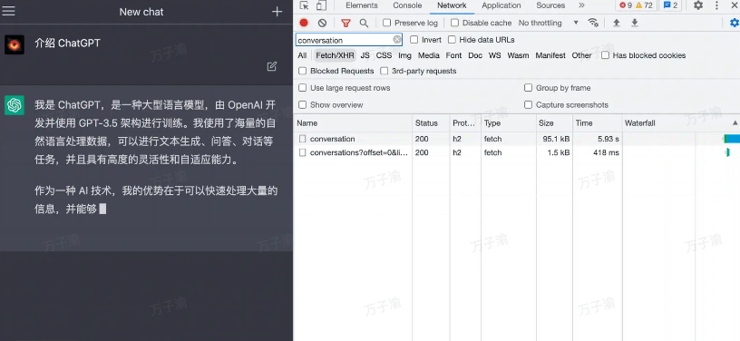
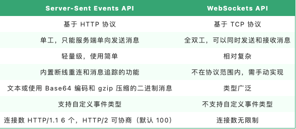
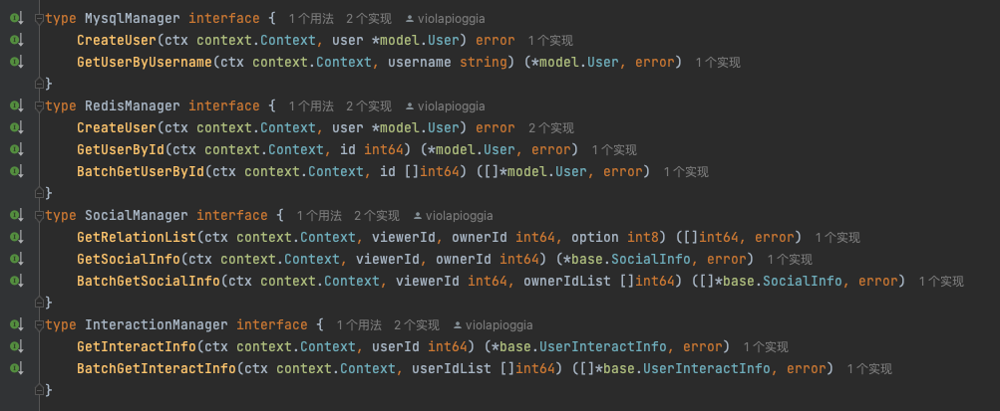
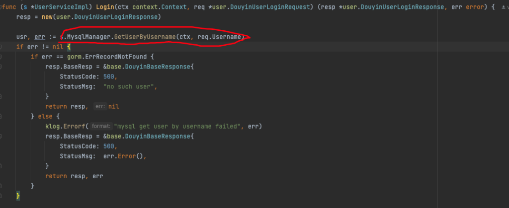
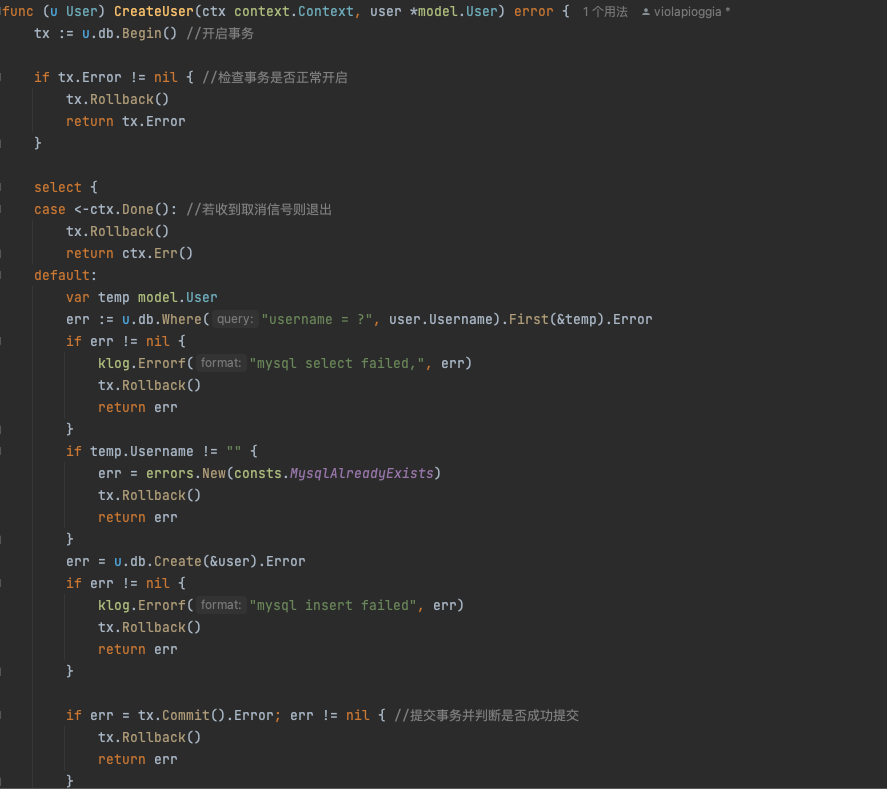

interface对于新手来说是个很抽象的东西，我们到底拿他来干嘛？好像不会这个也稀里糊涂的就过去了。

从最根本的来说，借用七米老师的一句话我从刚学记到现在——“接口是种类型，是一种抽象的类型”

讲解interface的用法之前首先我们来谈谈go语言的性质，我们都知道java是面向对象的语言，那么go也是吗？

从官网的解释来说，官方解答是yes and no。什么意思？既不是又是？意思就是不是规范的面向对象语言但是具备面向对象语言的一些特征。

go是允许oo风格的编程的，也就是面向对象的用法，但是同时又缺少了像java和c++里的常见类型继承结构。但是interface的发明能够帮助我们进行一些继承相关的操作

Go 中的 interface 接口有如下特性：

- 关于接口的定义和签名
    - 接口是一个或多个方法签名的集合，接口只有方法声明，没有实现，没有数据字段，只要某个类型拥有该接口的所有方法签名，那么就相当于实现了该接口，无需显示声明了哪个接口，这称为 Structural Typing。
    
    - interface 接口可以匿名嵌入其他接口中，或嵌入到 struct 结构中
    
    - 接口可以支持匿名字段方法

- 关于接口赋值
    - 只有当接口存储的类型和对象都为 nil 时，接口才等于 nil
    
    - 一个空的接口可以作为任何类型数据的容器
    
    - 如果两个接口都拥有相同的方法，那么它们就是等同的，任何实现了他们这个接口的对象之间，都可以相互赋值
    
    - 如果某个 struct 对象实现了某个接口的所有方法，那么可以直接将这个 struct 的实例对象直接赋值给这个接口类型的变量。

- 关于接口嵌套，Go 里面支持接口嵌套，但是不支持递归嵌套

- 通过接口可以实现面向对象编程中的多态的效果

## interface好用在哪里？

首先还是从interface的定义说起，interface可以帮助我们把类型抽象出来，比如要实现一类方法，如果事先不能确定类型，那么使用interface来编写方法再好不过。如果不使用interface就会出现以下情况

以至于以后可能还得重新写重复的方法

另一点也是我觉得非常好用的地方，当我们在编写大型项目中往往开发周期比较长，代码量也比较大，尽管分包来写也需要大量时间才能写出一个功能的完整代码，这种开发模式就令以前的我十分难受😣。但是interface就可以帮助我们分区域地开发，因为interface只需要关注方法的实现，也就是传入的参数和最终传出的参数。内部逻辑如何实现我们可以后面再去完成，就相当于一个黑箱我们只需要知道如何运行暂时就可以了。例如编写登陆功能的函数，我们只需要专注于登陆的逻辑编写，至于数据库等等其他功能组件我们可以用interface实现

interface还有其他实现，比如泛型，类型断言，能存放所有类型的数据等功能，这里暂且不提

总而言之用三个字评价interface——神中神
