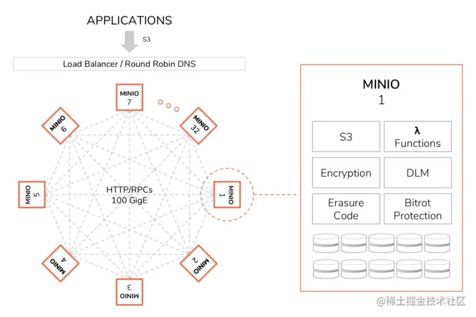
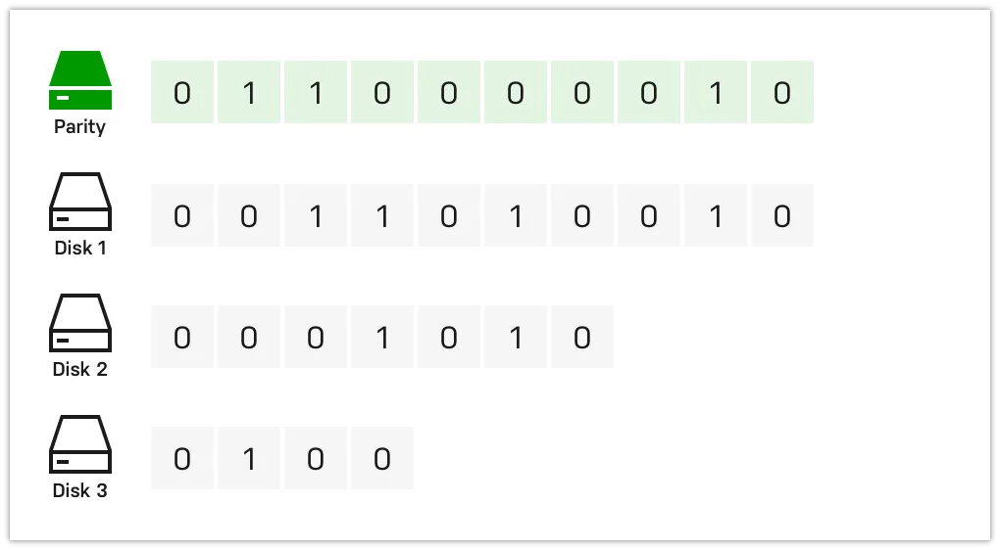

在上一节中我们走读了某对象存储网关层代码设计，今天我们来看一下同样是用 go 语言编写的知名开源对象存储项目 minio，然后我们就能知道有何不同。

# 总体设计

上一节中对象存储模型是分为了之间使用 rpc 进行通信的网关层、其他层以及 redis、apollo 等等，共同构成了一个高性能、高可用的分布式对象存储系统；而 minio 作为一款开源项目，非商业性以及开源性就决定了他必须是一款通用的并且易用的产品。

整体架构如下图所示，相比之下 minio 的架构设计更加的简单且去中心化，将网关、元数据存储、对象数据集成为一体，单节点承载一部分数据的分片，另外任何一个单独的节点拆出去都可以作为一个对象存储数据库来使用，因此 minio 通过建立众多的中小规模、易管理的集群，支持跨数据中心将多个集群聚合成超大资源池，而非直接采用大规模、统一管理的分布式集群。



# 基本功能

业界基本上都是按照 AWS S3 协议来实现，无非就是增删改查那一套，这方面大同小异，我们先从 Layer 初始化看起。

## NewErasureServerPools

Minio 通过 set 来管理调度磁盘等资源，然后将磁盘持久化等操作解耦成 API 接口方便网关 Achieve 层进行对象操作。

首先初始化资源，主要是确定程序运行所分配的 CPU、内存 等。

```
var (
    deploymentID       string
    commonParityDrives int
    err                error

    formats      = make([]*formatErasureV3, len(endpointServerPools))
    storageDisks = make([][]StorageAPI, len(endpointServerPools))
    z            = &erasureServerPools{
       serverPools:      make([]*erasureSets, len(endpointServerPools)),
       s3Peer:           NewS3PeerSys(endpointServerPools),
       distributionAlgo:formatErasureVersionV3DistributionAlgoV3,
    }
)

// Maximum number of reusable buffers per node at any given point in time.
n := uint64(1024) // single node single/multiple drives set this to 1024 entries

if globalIsDistErasure {
    n = 2048
}

// Avoid allocating more than half of the available memory
if maxN := availableMemory() / (blockSizeV2* 2); n > maxN {
    n = maxN
}

```

创建 storage API

```
// Depending on the disk type network or local, initialize storage API.
func newStorageAPI(endpoint Endpoint, opts storageOpts) (storage StorageAPI, err error) {
    if endpoint.IsLocal {
       // 本地 storage
       storage, err := newXLStorage(endpoint, opts.cleanUp)
       if err != nil {
          return nil, err
       }
       return newXLStorageDiskIDCheck(storage, opts.healthCheck), nil
    }

    //远程 storage，通过 RPC 调用
    return newStorageRESTClient(endpoint, opts.healthCheck, globalGrid.Load())
}

```

然后初始化 set 资源组，主要是连接 disk 并初始化对应的 API

```
// Initialize new set of erasure coded sets.
func newErasureSets(ctx context.Context, endpoints PoolEndpoints, storageDisks []StorageAPI, format *formatErasureV3, defaultParityCount, poolIdx int) (*erasureSets, error) {
    setCount := len(format.Erasure.Sets)
    setDriveCount := len(format.Erasure.Sets[0])

    endpointStrings := make([]string, len(endpoints.Endpoints))
    for i, endpoint := range endpoints.Endpoints {
       endpointStrings[i] = endpoint.String()
    }

    // Initialize the erasure sets instance.
    s := &erasureSets{
       sets:               make([]*erasureObjects, setCount),
       erasureDisks:       make([][]StorageAPI, setCount),
       erasureLockers:     make([][]dsync.NetLocker, setCount),
       erasureLockOwner:   globalLocalNodeName,
       endpoints:          endpoints,
       endpointStrings:    endpointStrings,
       setCount:           setCount,
       setDriveCount:      setDriveCount,
       defaultParityCount: defaultParityCount,
       format:             format,
       distributionAlgo:   format.Erasure.DistributionAlgo,
       deploymentID:       uuid.MustParse(format.ID),
       poolIndex:          poolIdx,
    }

    mutex := newNSLock(globalIsDistErasure)

    for i := 0; i < setCount; i++ {
       s.erasureDisks[i] = make([]StorageAPI, setDriveCount)
    }

    erasureLockers := map[string]dsync.NetLocker{}
    for _, endpoint := range endpoints.Endpoints {
       if _, ok := erasureLockers[endpoint.Host]; !ok {
          erasureLockers[endpoint.Host] = newLockAPI(endpoint)
       }
    }

    var wg sync.WaitGroup
    var lk sync.Mutex
    for i := 0; i < setCount; i++ {
       lockerEpSet := set.NewStringSet()
       for j := 0; j < setDriveCount; j++ {
          wg.Add(1)
          go func(i int, endpoint Endpoint) {
             defer wg.Done()

             lk.Lock()
             // Only add lockers only one per endpoint and per erasure set.
             if locker, ok := erasureLockers[endpoint.Host]; ok && !lockerEpSet.Contains(endpoint.Host) {
                lockerEpSet.Add(endpoint.Host)
                s.erasureLockers[i] = append(s.erasureLockers[i], locker)
             }
             lk.Unlock()
          }(i, endpoints.Endpoints[i*setDriveCount+j])
       }
    }
    wg.Wait()

    for i := 0; i < setCount; i++ {
       wg.Add(1)
       go func(i int) {
          defer wg.Done()

          var innerWg sync.WaitGroup
          for j := 0; j < setDriveCount; j++ {
             disk := storageDisks[i*setDriveCount+j]
             if disk == nil {
                continue
             }

             if disk.IsLocal() && globalIsDistErasure {
                globalLocalDrivesMu.RLock()
                ldisk := globalLocalSetDrives[poolIdx][i][j]
                if ldisk == nil {
                   globalLocalDrivesMu.RUnlock()
                   continue
                }
                disk.Close()
                disk = ldisk
                globalLocalDrivesMu.RUnlock()
             }

             innerWg.Add(1)
             go func(disk StorageAPI, i, j int) {
                defer innerWg.Done()
                diskID, err := disk.GetDiskID()
                if err != nil {
                   if !errors.Is(err, errUnformattedDisk) {
                      bootLogIf(ctx, err)
                   }
                   return
                }
                if diskID == "" {
                   return
                }
                s.erasureDisks[i][j] = disk
             }(disk, i, j)
          }

          innerWg.Wait()

          // Initialize erasure objects for a given set.
          s.sets[i] = &erasureObjects{
             setIndex:           i,
             poolIndex:          poolIdx,
             setDriveCount:      setDriveCount,
             defaultParityCount: defaultParityCount,
             getDisks:           s.GetDisks(i),
             getLockers:         s.GetLockers(i),
             getEndpoints:       s.GetEndpoints(i),
             getEndpointStrings: s.GetEndpointStrings(i),
             nsMutex:            mutex,
          }
       }(i)
    }

    wg.Wait()

    // start cleanup stale uploads go-routine.
    go s.cleanupStaleUploads(ctx)

    // start cleanup of deleted objects.
    go s.cleanupDeletedObjects(ctx)

    // Start the disk monitoring and connect routine.
    if !globalIsTesting {
       go s.monitorAndConnectEndpoints(ctx,defaultMonitorConnectEndpointInterval)
    }

    return s, nil
}

```

## PutObject

在 handler 还是经典的处理请求头 and 适配 s3 协议起手，处理一下 tag 、配置一下 checksum 校验啥的

```
// X-Amz-Copy-Source shouldn't be set for this call.
if _, ok := r.Header[xhttp.AmzCopySource]; ok {
    writeErrorResponse(ctx, w, errorCodes.ToAPIErr(ErrInvalidCopySource), r.URL)
    return
}

// Validate storage class metadata if present
if sc := r.Header.Get(xhttp.AmzStorageClass); sc != "" {
    if !storageclass.IsValid(sc) {
       writeErrorResponse(ctx, w, errorCodes.ToAPIErr(ErrInvalidStorageClass), r.URL)
       return
    }
}

clientETag, err := etag.FromContentMD5(r.Header)
if err != nil {
    writeErrorResponse(ctx, w, errorCodes.ToAPIErr(ErrInvalidDigest), r.URL)
    return
}

// if Content-Length is unknown/missing, deny the request
size := r.ContentLength
rAuthType := getRequestAuthType(r)
switch rAuthType {
// Check signature types that must have content length
caseauthTypeStreamingSigned,authTypeStreamingSignedTrailer,authTypeStreamingUnsignedTrailer:
    if sizeStr, ok := r.Header[xhttp.AmzDecodedContentLength]; ok {
       if sizeStr[0] == "" {
          writeErrorResponse(ctx, w, errorCodes.ToAPIErr(ErrMissingContentLength), r.URL)
          return
       }
       size, err = strconv.ParseInt(sizeStr[0], 10, 64)
       if err != nil {
          writeErrorResponse(ctx, w, toAPIError(ctx, err), r.URL)
          return
       }
    }
}

```

检验不同版本的签名

```
switch rAuthType {
caseauthTypeStreamingSigned,authTypeStreamingSignedTrailer:
    // Initialize stream signature verifier.
    rd, s3Err = newSignV4ChunkedReader(r, rAuthType ==authTypeStreamingSignedTrailer)
    if s3Err !=ErrNone{
       writeErrorResponse(ctx, w, errorCodes.ToAPIErr(s3Err), r.URL)
       return
    }
caseauthTypeStreamingUnsignedTrailer:
    // Initialize stream chunked reader with optional trailers.
    rd, s3Err = newUnsignedV4ChunkedReader(r, true)
    if s3Err !=ErrNone{
       writeErrorResponse(ctx, w, errorCodes.ToAPIErr(s3Err), r.URL)
       return
    }
caseauthTypeSignedV2,authTypePresignedV2:
    s3Err = isReqAuthenticatedV2(r)
    if s3Err !=ErrNone{
       writeErrorResponse(ctx, w, errorCodes.ToAPIErr(s3Err), r.URL)
       return
    }

caseauthTypePresigned,authTypeSigned:
    if s3Err = reqSignatureV4Verify(r, globalSite.Region(),serviceS3); s3Err !=ErrNone{
       writeErrorResponse(ctx, w, errorCodes.ToAPIErr(s3Err), r.URL)
       return
    }
    if !skipContentSha256Cksum(r) {
       sha256hex = getContentSha256Cksum(r,serviceS3)
    }
}

```

比较让人眼前一亮的是这里对对象使用了压缩

```
actualSize := size
var idxCb func() []byte
// > 4MB 开启压缩
if isCompressible(r.Header, object) && size >minCompressibleSize{
    // Storing the compression metadata.
    metadata[ReservedMetadataPrefix+"compression"] =compressionAlgorithmV2metadata[ReservedMetadataPrefix+"actual-size"] = strconv.FormatInt(size, 10)

    actualReader, err := hash.NewReader(ctx, reader, size, md5hex, sha256hex, actualSize)
    if err != nil {
       writeErrorResponse(ctx, w, toAPIError(ctx, err), r.URL)
       return
    }
    if err = actualReader.AddChecksum(r, false); err != nil {
       writeErrorResponse(ctx, w, errorCodes.ToAPIErr(ErrInvalidChecksum), r.URL)
       return
    }
    // Set compression metrics.
    var s2c io.ReadCloser
    wantEncryption := crypto.Requested(r.Header)
    s2c, idxCb = newS2CompressReader(actualReader, actualSize, wantEncryption)
    defer s2c.Close()

    reader = etag.Wrap(s2c, actualReader)
    size = -1   // Since compressed size is un-predictable.
    md5hex = "" // Do not try to verify the content.
    sha256hex = ""
}

// newS2CompressReader will read data from r, compress it and return the compressed data as a Reader.
// Use Close to ensure resources are released on incomplete streams.
//
// input 'on' is always recommended such that this function works
// properly, because we do not wish to create an object even if
// client closed the stream prematurely.
func newS2CompressReader(r io.Reader, on int64, encrypted bool) (rc io.ReadCloser, idx func() []byte) {
    // io 管道
    pr, pw := io.Pipe()
    // Copy input to compressor
    opts := compressOpts
    if encrypted {
       // The values used for padding are not a security concern,
       // but we choose pseudo-random numbers instead of just zeros.
       rng := rand.New(rand.NewSource(time.Now().UnixNano()))
       opts = append([]s2.WriterOption{s2.WriterPadding(compPadEncrypted), s2.WriterPaddingSrc(rng)}, compressOpts...)
    }
    comp := s2.NewWriter(pw, opts...)
    indexCh := make(chan []byte, 1)
    go func() {
       defer xioutil.SafeClose(indexCh)
       cn, err := io.Copy(comp, r)
       if err != nil {
          comp.Close()
          pw.CloseWithError(err)
          return
       }
       if on > 0 && on != cn {
          // if client didn't sent all data
          // from the client verify here.
          comp.Close()
          pw.CloseWithError(IncompleteBody{})
          return
       }
       // Close the stream.
       // If more than compMinIndexSize was written, generate index.
       if cn >compMinIndexSize{
          idx, err := comp.CloseIndex()
          idx = s2.RemoveIndexHeaders(idx)
          indexCh <- idx
          pw.CloseWithError(err)
          return
       }
       pw.CloseWithError(comp.Close())
    }()
    var gotIdx []byte
    return pr, func() []byte {
       if gotIdx != nil {
          return gotIdx
       }
       // Will get index or nil if closed.
       gotIdx = <-indexCh
       return gotIdx
    }
}

```

然后到了 achieve 层，因为整体架构是去中心化的，首先如果是单机部署则直接执行 put 操作，否则先需要判断在哪个节点上进行 put

```
// PutObject - writes an object to least used erasure pool.
func (z *erasureServerPools) PutObject(ctx context.Context, bucket string, object string, data *PutObjReader, opts ObjectOptions) (ObjectInfo, error) {
    // Validate put object input args.
    if err := checkPutObjectArgs(ctx, bucket, object); err != nil {
       return ObjectInfo{}, err
    }

    object = encodeDirObject(object)
    if z.SinglePool() {
       return z.serverPools[0].PutObject(ctx, bucket, object, data, opts)
    }

    idx, err := z.getPoolIdx(ctx, bucket, object, data.Size())
    if err != nil {
       return ObjectInfo{}, err
    }

    if opts.DataMovement && idx == opts.SrcPoolIdx {
       return ObjectInfo{}, DataMovementOverwriteErr{
          Bucket:    bucket,
          Object:    object,
          VersionID: opts.VersionID,
          Err:       errDataMovementSrcDstPoolSame,
       }
    }

    return z.serverPools[idx].PutObject(ctx, bucket, object, data, opts)
}

```

```
func (z *erasureServerPools) getPoolInfoExistingWithOpts(ctx context.Context, bucket, object string, opts ObjectOptions) (PoolObjInfo, []poolErrs, error) {
    var noReadQuorumPools []poolErrs
    poolObjInfos := make([]PoolObjInfo, len(z.serverPools))
    poolOpts := make([]ObjectOptions, len(z.serverPools))
    for i := range z.serverPools {
       poolOpts[i] = opts
    }

    var wg sync.WaitGroup
    for i, pool := range z.serverPools {
       wg.Add(1)
       go func(i int, pool *erasureSets, opts ObjectOptions) {
          defer wg.Done()
          // remember the pool index, we may sort the slice original index might be lost.
          pinfo := PoolObjInfo{
             Index: i,
          }
          // do not remove this check as it can lead to inconsistencies
          // for all callers of bucket replication.
          if !opts.MetadataChg {
             opts.VersionID = ""
          }
          // 轮询当前 pool 中的所有节点，这点性能就有点差了
          pinfo.ObjInfo, pinfo.Err = pool.GetObjectInfo(ctx, bucket, object, opts)
          poolObjInfos[i] = pinfo
       }(i, pool, poolOpts[i])
    }
    wg.Wait()

    // Sort the objInfos such that we always serve latest
    // this is a defensive change to handle any duplicate
    // content that may have been created, we always serve
    // the latest object.
    // 排序方便查找
    sort.Slice(poolObjInfos, func(i, j int) bool {
       mtime1 := poolObjInfos[i].ObjInfo.ModTime
       mtime2 := poolObjInfos[j].ObjInfo.ModTime
       return mtime1.After(mtime2)
    })

    defPool := PoolObjInfo{Index: -1}
    for _, pinfo := range poolObjInfos {
       // skip all objects from suspended pools if asked by the
       // caller.
       if opts.SkipDecommissioned && z.IsSuspended(pinfo.Index) {
          continue
       }
       // Skip object if it's from pools participating in a rebalance operation.
       if opts.SkipRebalancing && z.IsPoolRebalancing(pinfo.Index) {
          continue
       }
       if pinfo.Err == nil {
          // found a pool
          // 找到了一个 pinfo，这点能看出来数据是没有多个分片备份的？
          return pinfo, z.poolsWithObject(poolObjInfos, opts), nil
       }

       if isErrReadQuorum(pinfo.Err) && !opts.MetadataChg {
          // read quorum is returned when the object is visibly
          // present but its unreadable, we simply ask the writes to
          // schedule to this pool instead. If there is no quorum
          // it will fail anyways, however if there is quorum available
          // with enough disks online but sufficiently inconsistent to
          // break parity threshold, allow them to be overwritten
          // or allow new versions to be added.

          return pinfo, z.poolsWithObject(poolObjInfos, opts), nil
       }
       defPool = pinfo
       if !isErrObjectNotFound(pinfo.Err) && !isErrVersionNotFound(pinfo.Err) {
          return pinfo, noReadQuorumPools, pinfo.Err
       }

       // No object exists or its a delete marker,
       // check objInfo to confirm.
       if pinfo.ObjInfo.DeleteMarker && pinfo.ObjInfo.Name != "" {
          return pinfo, noReadQuorumPools, nil
       }
    }
    if opts.ReplicationRequest && opts.DeleteMarker && defPool.Index >= 0 {
       // If the request is a delete marker replication request, return a default pool
       // in cases where the object does not exist.
       // This is to ensure that the delete marker is replicated to the destination.
       return defPool, noReadQuorumPools, nil
    }
    return PoolObjInfo{}, noReadQuorumPools, toObjectErr(errFileNotFound, bucket, object)
}

```

然后才在对应节点进行 PutObject 操作

```
return z.serverPools[idx].PutObject(ctx, bucket, object, data, opts)

// PutObject - writes an object to hashedSet based on the object name.
func (s *erasureSets) PutObject(ctx context.Context, bucket string, object string, data *PutObjReader, opts ObjectOptions) (objInfo ObjectInfo, err error) {
    set := s.getHashedSet(object)
    return set.PutObject(ctx, bucket, object, data, opts)
}

```

Set 是一个全局哈希表存储的资源对象，用于 ER 操作，这里的初始化过程就不多赘述了

```
type erasureObjects struct {
    setDriveCount      int
    defaultParityCount int
    setIndex           int
    poolIndex          int
    getDisks           func() []StorageAPI
    getLockers         func() ([]dsync.NetLocker, string)
    getEndpoints       func() []Endpoint
    getEndpointStrings func() []string
    nsMutex            *nsLockMap
}

```

接下来就是重头戏——如何保存元信息以及数据存盘

```
// putObject wrapper for erasureObjects PutObject
func (er erasureObjects) putObject(ctx context.Context, bucket string, object string, r *PutObjReader, opts ObjectOptions) (objInfo ObjectInfo, err error) {
    // ...
    data := r.Reader

    // ...

    // Validate input data size and it can never be less than -1.
    if data.Size() < -1 {
       bugLogIf(ctx, errInvalidArgument, logger.ErrorKind)
       return ObjectInfo{}, toObjectErr(errInvalidArgument)
    }

    userDefined := cloneMSS(opts.UserDefined)

    storageDisks := er.getDisks()

    // Get parity and data drive count based on storage class metadata
    // 获取奇偶校验盘数量
    parityDrives := globalStorageClass.GetParityForSC(userDefined[xhttp.AmzStorageClass])
    if parityDrives < 0 {
       parityDrives = er.defaultParityCount
    }
    if opts.MaxParity {
       // 校验盘最多为存储介质数量的一半
       parityDrives = len(storageDisks) / 2
    }
    // 如果没达到上限并且开启了 storageClass 优化
    if !opts.MaxParity && globalStorageClass.AvailabilityOptimized() {
    // If we have offline disks upgrade the number of erasure codes for this object.
    // 把离线的盘当作校验盘
    parityOrig := parityDrives

    var offlineDrives int
    for _, disk := range storageDisks {
       if disk == nil || !disk.IsOnline() {
          parityDrives++
          offlineDrives++
          continue
       }
    }

    if offlineDrives >= (len(storageDisks)+1)/2 {
       // if offline drives are more than 50% of the drives
       // we have no quorum, we shouldn't proceed just
       // fail at that point.
       return ObjectInfo{}, toObjectErr(errErasureWriteQuorum, bucket, object)
    }

    if parityDrives >= len(storageDisks)/2 {
       parityDrives = len(storageDisks) / 2
    }

    if parityOrig != parityDrives {
       userDefined[minIOErasureUpgraded] = strconv.Itoa(parityOrig) + "->" + strconv.Itoa(parityDrives)
    }
}

    // ...

```

在这里看到 parity and data drive 没太懂是什么意思，后来在网上查找资料之后才明白这是一个在存储系统中很重要的组件，可以用来实现数据的冗余和重建，也称之为纠删码（erasure code）

在下面这个例子中仅需一个 Parity 即可实现数据校验和重建，如果校验盘或多个阵列数据盘出现故障可能就会导致数据无法恢复，在这种情况下就需要增加奇偶校验盘了，当然也会导致性能降低



```
// ...
dataDrives := len(storageDisks) - parityDrives

// we now know the number of blocks this object needs for data and parity.
// writeQuorum is dataBlocks + 1
// 写入所有数据盘才视为写成功
writeQuorum := dataDrives
if dataDrives == parityDrives {
    writeQuorum++
}

```

初始化元信息配置

```
// Initialize parts metadata
partsMetadata := make([]FileInfo, len(storageDisks))

fi := newFileInfo(pathJoin(bucket, object), dataDrives, parityDrives)
fi.VersionID = opts.VersionID
if opts.Versioned && fi.VersionID == "" {
    fi.VersionID = mustGetUUID()
}

fi.DataDir = mustGetUUID()
if ckSum := userDefined[ReplicationSsecChecksumHeader]; ckSum != "" {
    if v, err := base64.StdEncoding.DecodeString(ckSum); err == nil {
       fi.Checksum = v
    }
    delete(userDefined,ReplicationSsecChecksumHeader)
}
uniqueID := mustGetUUID()
tempObj := uniqueID

// Initialize erasure metadata.
for index := range partsMetadata {
    partsMetadata[index] = fi
}

// Order disks according to erasure distribution
var onlineDisks []StorageAPI
onlineDisks, partsMetadata = shuffleDisksAndPartsMetadata(storageDisks, partsMetadata, fi)

```

从内存池分配内存缓冲区

```
erasure, err := NewErasure(ctx, fi.Erasure.DataBlocks, fi.Erasure.ParityBlocks, fi.Erasure.BlockSize)
if err != nil {
    return ObjectInfo{}, toObjectErr(err, bucket, object)
}

// Fetch buffer for I/O, returns from the pool if not allocates a new one and returns.
var buffer []byte
switch size := data.Size(); {
// 设置 EOF 占位符
case size == 0:
    buffer = make([]byte, 1) // Allocate at least a byte to reach EOF
// 超过 fi.Erasure.BlockSize 则分配内存
case size >= fi.Erasure.BlockSize || size == -1:
    buffer = globalBytePoolCap.Load().Get()
    defer globalBytePoolCap.Load().Put(buffer)
// 小于则直接用 make 分配内存
case size < fi.Erasure.BlockSize:
    // No need to allocate fully blockSizeV1 buffer if the incoming data is smaller.
    buffer = make([]byte, size, 2*size+int64(fi.Erasure.ParityBlocks+fi.Erasure.DataBlocks-1))
}

if len(buffer) > int(fi.Erasure.BlockSize) {
    buffer = buffer[:fi.Erasure.BlockSize]
}

```

```
// 上传临时对象
partName := "part.1"
tempErasureObj := pathJoin(uniqueID, fi.DataDir, partName)

// 回收临时对象
defer er.deleteAll(context.Background(),minioMetaTmpBucket, tempObj)

// 判断对象是否嵌入上传，<= 128KB/16KB
var inlineBuffers []*bytes.Buffer
if globalStorageClass.ShouldInline(erasure.ShardFileSize(data.ActualSize()), opts.Versioned) {
    inlineBuffers = make([]*bytes.Buffer, len(onlineDisks))
}

// 计算实际上传分片大小，每一个 erasure 有一个 blockSize
shardFileSize := erasure.ShardFileSize(data.Size())

```

```
writers := make([]io.Writer, len(onlineDisks))
for i, disk := range onlineDisks {
    if disk == nil {
       continue
    }

    if !disk.IsOnline() {
       continue
    }

    // 嵌入上传
    if len(inlineBuffers) > 0 {
       buf := grid.GetByteBufferCap(int(shardFileSize) + 64)
       inlineBuffers[i] = bytes.NewBuffer(buf[:0])
       defer grid.PutByteBuffer(buf)
       writers[i] = newStreamingBitrotWriterBuffer(inlineBuffers[i],DefaultBitrotAlgorithm, erasure.ShardSize())
       continue
    }

    writers[i] = newBitrotWriter(disk, bucket,minioMetaTmpBucket, tempErasureObj, shardFileSize,DefaultBitrotAlgorithm, erasure.ShardSize())
}

toEncode := io.Reader(data)
if data.Size() >=bigFileThreshold{
    // We use 2 buffers, so we always have a full buffer of input.
    // 使用两个 buffers，返回一个 ra reader，并发性能更强
    pool := globalBytePoolCap.Load()
    bufA := pool.Get()
    bufB := pool.Get()
    defer pool.Put(bufA)
    defer pool.Put(bufB)
    ra, err := readahead.NewReaderBuffer(data, [][]byte{bufA[:fi.Erasure.BlockSize], bufB[:fi.Erasure.BlockSize]})
    if err == nil {
       toEncode = ra
       defer ra.Close()
    }
    bugLogIf(ctx, err)
}
n, erasureErr := erasure.Encode(ctx, toEncode, writers, buffer, writeQuorum)
closeBitrotWriters(writers)
if erasureErr != nil {
    return ObjectInfo{}, toObjectErr(erasureErr, bucket, object)
}

// Should return IncompleteBody{} error when reader has fewer bytes
// than specified in request header.
if n < data.Size() {
    return ObjectInfo{}, IncompleteBody{Bucket: bucket, Object: object}
}

```

erasure.Encode 中实现了具体持久化的逻辑

```
// Encode reads from the reader, erasure-encodes the data and writes to the writers.
func (e *Erasure) Encode(ctx context.Context, src io.Reader, writers []io.Writer, buf []byte, quorum int) (total int64, err error) {
    writer := &multiWriter{
       writers:     writers,
       writeQuorum: quorum,
       errs:        make([]error, len(writers)),
    }

    for {
       var blocks [][]byte
       n, err := io.ReadFull(src, buf)
       if err != nil {
          if !IsErrIgnored(err, []error{
             io.EOF,
             io.ErrUnexpectedEOF,
          }...) {
             return 0, err
          }
       }

       eof := err == io.EOF || err == io.ErrUnexpectedEOF
       if n == 0 && total != 0 {
          // Reached EOF, nothing more to be done.
          break
       }

       // We take care of the situation where if n == 0 and total == 0 by creating empty data and parity files.
       blocks, err = e.EncodeData(ctx, buf[:n])
       if err != nil {
          return 0, err
       }

       if err = writer.Write(ctx, blocks); err != nil {
          return 0, err
       }

       total += int64(n)
       if eof {
          break
       }
    }
    return total, nil
}

// Write writes data to writers.
func (p *multiWriter) Write(ctx context.Context, blocks [][]byte) error {
    for i := range p.writers {
       if p.errs[i] != nil {
          continue
       }
       if p.writers[i] == nil {
          p.errs[i] = errDiskNotFound
          continue
       }
       var n int
       // for 循环向每一个 writer 写 block 数据
       n, p.errs[i] = p.writers[i].Write(blocks[i])
       if p.errs[i] == nil {
          if n != len(blocks[i]) {
             p.errs[i] = io.ErrShortWrite
             p.writers[i] = nil
          }
       } else {
          p.writers[i] = nil
       }
    }

    // If nilCount >= p.writeQuorum, we return nil. This is because HealFile() uses
    // CreateFile with p.writeQuorum=1 to accommodate healing of single disk.
    // i.e if we do no return here in such a case, reduceWriteQuorumErrs() would
    // return a quorum error to HealFile().
    // 如果成功个数超过 writeQuorum 的值则认为成功，其余的会有 HealFile() 来自愈
    nilCount := countErrs(p.errs, nil)
    if nilCount >= p.writeQuorum {
       return nil
    }

    writeErr := reduceWriteQuorumErrs(ctx, p.errs, objectOpIgnoredErrs, p.writeQuorum)
    return fmt.Errorf("%w (offline-disks=%d/%d)", writeErr, countErrs(p.errs, errDiskNotFound), len(p.writers))
}

```

创建的 writer 通过write 方法来实现写入磁盘，写入的是临时 bucket 和 临时 object。

```
func (b *wholeBitrotWriter) Write(p []byte) (int, error) {
    err := b.disk.AppendFile(context.TODO(), b.volume, b.filePath, p)
    if err != nil {
       return 0, err
    }
    _, err = b.Hash.Write(p)
    if err != nil {
       return 0, err
    }
    return len(p), nil
}

```

```
// AppendFile - append a byte array at path, if file doesn't exist at
// path this call explicitly creates it.
func (s *xlStorage) AppendFile(ctx context.Context, volume string, path string, buf []byte) (err error) {
    volumeDir, err := s.getVolDir(volume)
    if err != nil {
       return err
    }

    if !skipAccessChecks(volume) {
       // Stat a volume entry.
       if err = Access(volumeDir); err != nil {
          return convertAccessError(err, errVolumeAccessDenied)
       }
    }

    filePath := pathJoin(volumeDir, path)
    if err = checkPathLength(filePath); err != nil {
       return err
    }

    var w *os.File
    // Create file if not found. Not doing O_DIRECT here to avoid the code that does buffer aligned writes.
    // AppendFile() is only used by healing code to heal objects written in old format.
    w, err = s.openFileSync(filePath, os.O_CREATE|os.O_APPEND|os.O_WRONLY, volumeDir)
    if err != nil {
       return err
    }
    defer w.Close()

    n, err := w.Write(buf)
    if err != nil {
       return err
    }

    if n != len(buf) {
       return io.ErrShortWrite
    }

    return nil
}

```

openFile 就很简单地调用系统 os 包进行写文件。

```
func (s *xlStorage) openFile(filePath string, mode int, skipParent string) (f *os.File, err error) {
    if skipParent == "" {
       skipParent = s.drivePath
    }
    // Create top level directories if they don't exist.
    // with mode 0777 mkdir honors system umask.
    if err = mkdirAll(pathutil.Dir(filePath), 0o777, skipParent); err != nil {
       return nil, osErrToFileErr(err)
    }

    w, err := OpenFile(filePath, mode, 0o666)
    if err != nil {
       // File path cannot be verified since one of the parents is a file.
       switch {
       case isSysErrIsDir(err):
          return nil, errIsNotRegular
       case osIsPermission(err):
          return nil, errFileAccessDenied
       case isSysErrNotDir(err):
          return nil, errFileAccessDenied
       case isSysErrIO(err):
          return nil, errFaultyDisk
       case isSysErrTooManyFiles(err):
          return nil, errTooManyOpenFiles
       default:
          return nil, err
       }
    }

    return w, nil
}

```

上传完对象实际数据之后开始处理 meta data，minio 并未单独使用元数据库保存元数据，而是与对象数据一起存在存储介质上，有助于快速读写

```
for i, w := range writers {
    if w == nil {
       onlineDisks[i] = nil
       continue
    }
    if len(inlineBuffers) > 0 && inlineBuffers[i] != nil {
       partsMetadata[i].Data = inlineBuffers[i].Bytes()
    } else {
       partsMetadata[i].Data = nil
    }
    // No need to add checksum to part. We already have it on the object.
    partsMetadata[i].AddObjectPart(1, "", n, actualSize, modTime, compIndex, nil)
    partsMetadata[i].Versioned = opts.Versioned || opts.VersionSuspended
    partsMetadata[i].Checksum = fi.Checksum
}

// ...

// Fill all the necessary metadata.
// Update `xl.meta` content on each disks.
for index := range partsMetadata {
    partsMetadata[index].Metadata = userDefined
    partsMetadata[index].Size = n
    partsMetadata[index].ModTime = modTime
    if len(inlineBuffers) > 0 {
       partsMetadata[index].SetInlineData()
    }
    if opts.DataMovement {
       partsMetadata[index].SetDataMov()
    }
}

// Rename the successfully written temporary object to final location.
// 逻辑是把 partsMetadata 传到之前的 tmpObj 处然后再改名为上传的 obj name
onlineDisks, versions, oldDataDir, err := renameData(ctx, onlineDisks,minioMetaTmpBucket, tempObj, partsMetadata, bucket, object, writeQuorum)
if err != nil {
    if errors.Is(err, errFileNotFound) {
       // An in-quorum errFileNotFound means that client stream
       // prematurely closed and we do not find any xl.meta or
       // part.1's - in such a scenario we must return as if client
       // disconnected. This means that erasure.Encode() CreateFile()
       // did not do anything.
       return ObjectInfo{}, IncompleteBody{Bucket: bucket, Object: object}
    }
    return ObjectInfo{}, toObjectErr(err, bucket, object)
}

if err = er.commitRenameDataDir(ctx, bucket, object, oldDataDir, onlineDisks, writeQuorum); err != nil {
    return ObjectInfo{}, toObjectErr(err, bucket, object)
}

```

Rename 逻辑比较复杂，不仅有目录结构的转换，还有版本控制以及失败情况下的回滚。个人感觉 minio 源码一些地方命名有点奇怪，excode 里面有持久化的逻辑，rename 也有迁移和持久化的逻辑。

```
func (s *xlStorage) RenameData(ctx context.Context, srcVolume, srcPath string, fi FileInfo, dstVolume, dstPath string, opts RenameOptions) (res RenameDataResp, err error) {
    //...
    srcVolumeDir, err := s.getVolDir(srcVolume)
    if err != nil {
        return res, err
    }

    dstVolumeDir, err := s.getVolDir(dstVolume)
    if err != nil {
        return res, err
    }

    if !skipAccessChecks(srcVolume) {
        // Stat a volume entry.
        if err = Access(srcVolumeDir); err != nil {
           return res, convertAccessError(err, errVolumeAccessDenied)
        }
    }

    if !skipAccessChecks(dstVolume) {
        if err = Access(dstVolumeDir); err != nil {
           return res, convertAccessError(err, errVolumeAccessDenied)
        }
    }

    // .../xl.meta
    srcFilePath := pathutil.Join(srcVolumeDir, pathJoin(srcPath,xlStorageFormatFile))
    dstFilePath := pathutil.Join(dstVolumeDir, pathJoin(dstPath,xlStorageFormatFile))

    // ...
    // 非内联数据调用封装的 os.Rename
    notInline := srcDataPath != "" && len(fi.Data) == 0 && fi.Size > 0
    if notInline {
        if healing {
           // renameAll only for objects that have xl.meta not saved inline.
           // this must be done in healing only, otherwise it is expected
           // that for fresh PutObject() call dstDataPath can never exist.
           // if its an overwrite then the caller deletes the DataDir
           // in a separate RPC call.
           s.moveToTrash(dstDataPath, true, false)

           // If we are healing we should purge any legacyDataPath content,
           // that was previously preserved during PutObject() call
           // on a versioned bucket.
           s.moveToTrash(legacyDataPath, true, false)
        }
        if contextCanceled(ctx) {
           return res, ctx.Err()
        }
        if err = renameAll(srcDataPath, dstDataPath, skipParent); err != nil {
           if legacyPreserved {
              // Any failed rename calls un-roll previous transaction.
              s.deleteFile(dstVolumeDir, legacyDataPath, true, false)
           }
           // if its a partial rename() do not attempt to delete recursively.
           s.deleteFile(dstVolumeDir, dstDataPath, false, false)
           return res, osErrToFileErr(err)
        }
        diskHealthCheckOK(ctx, err)
    }
}

```

如果数据内联则直接修改 xl.meta

```
// If we have oldDataDir then we must preserve current xl.meta
// as backup, in-case needing renames().
if res.OldDataDir != "" {
    if contextCanceled(ctx) {
       return res, ctx.Err()
    }

    // preserve current xl.meta inside the oldDataDir.
    if err = s.writeAll(ctx, dstVolume, pathJoin(dstPath, res.OldDataDir,xlStorageFormatFileBackup), dstBuf, true, skipParent); err != nil {
       if legacyPreserved {
          s.deleteFile(dstVolumeDir, legacyDataPath, true, false)
       }
       return res, osErrToFileErr(err)
    }
    diskHealthCheckOK(ctx, err)
}

if contextCanceled(ctx) {
    return res, ctx.Err()
}

// Commit meta-file
if err = renameAll(srcFilePath, dstFilePath, skipParent); err != nil {
    if legacyPreserved {
       // Any failed rename calls un-roll previous transaction.
       s.deleteFile(dstVolumeDir, legacyDataPath, true, false)
    }
    // if its a partial rename() do not attempt to delete recursively.
    // this can be healed since all parts are available.
    s.deleteFile(dstVolumeDir, dstDataPath, false, false)
    return res, osErrToFileErr(err)
}

```

最后尝试 heal 下线的盘

```
// For speedtest objects do not attempt to heal them.
if !opts.Speedtest {
    // When there is versions disparity we are healing
    // the content implicitly for all versions, we can
    // avoid triggering another MRF heal for offline drives.
    if len(versions) == 0 {
       // Whether a disk was initially or becomes offline
       // during this upload, send it to the MRF list.
       for i := 0; i < len(onlineDisks); i++ {
          if onlineDisks[i] != nil && onlineDisks[i].IsOnline() {
             continue
          }

          er.addPartial(bucket, object, fi.VersionID)
          break
       }
    } else {
       globalMRFState.addPartialOp(PartialOperation{
          Bucket:    bucket,
          Object:    object,
          Queued:    time.Now(),
          Versions:  versions,
          SetIndex:  er.setIndex,
          PoolIndex: er.poolIndex,
       })
    }
}

```

## GetObject

直接来看 achieve 层

通过 bucket、object 以及 opts 获取 object 元信息

```
func (er erasureObjects) getObjectFileInfo(ctx context.Context, bucket, object string, opts ObjectOptions, readData bool) (FileInfo, []FileInfo, []StorageAPI, error) {
    rawArr := make([]RawFileInfo, er.setDriveCount)
    metaArr := make([]FileInfo, er.setDriveCount)
    errs := make([]error, er.setDriveCount)
    for i := range errs {
       errs[i] = errDiskOngoingReq
    }

    done := make(chan bool, er.setDriveCount)
    disks := er.getDisks()

    ropts := ReadOptions{
       ReadData:         readData,
       InclFreeVersions: opts.InclFreeVersions,
       Healing:          false,
    }

    mrfCheck := make(chan FileInfo)
    defer xioutil.SafeClose(mrfCheck)

    var rw sync.Mutex

    // Ask for all disks first;
    go func() {
       ctx, cancel := context.WithCancel(ctx)
       defer cancel()

       wg := sync.WaitGroup{}
       // 并发遍历 disks 获取 fileInfo
       for i, disk := range disks {
          if disk == nil {
             done <- false
             continue
          }
          if !disk.IsOnline() {
             done <- false
             continue
          }
          wg.Add(1)
          go func(i int, disk StorageAPI) {
             defer wg.Done()

             var (
                fi  FileInfo
                rfi RawFileInfo
                err error
             )

             if opts.VersionID != "" {
                // Read a specific version ID
                fi, err = disk.ReadVersion(ctx, "", bucket, object, opts.VersionID, ropts)
             } else {
                // Read the latest version
                rfi, err = disk.ReadXL(ctx, bucket, object, readData)
                if err == nil {
                   fi, err = fileInfoFromRaw(rfi, bucket, object, readData, opts.InclFreeVersions)
                }
             }

             rw.Lock()
             rawArr[i] = rfi
             metaArr[i], errs[i] = fi, err
             rw.Unlock()

             done <- err == nil
          }(i, disk)
       }

       wg.Wait()
       xioutil.SafeClose(done)

       fi, ok := <-mrfCheck
       if !ok {
          return
       }

       if fi.Deleted {
          return
       }

       // if one of the disk is offline, return right here no need
       // to attempt a heal on the object.
       if countErrs(errs, errDiskNotFound) > 0 {
          return
       }

       var missingBlocks int
       for i := range errs {
          if IsErr(errs[i],
             errFileNotFound,
             errFileVersionNotFound,
             errFileCorrupt,
          ) {
             missingBlocks++
          }
       }

       // if missing metadata can be reconstructed, attempt to reconstruct.
       // additionally do not heal delete markers inline, let them be
       // healed upon regular heal process.
       // 重建 missingBlocks
       if missingBlocks > 0 && missingBlocks < fi.Erasure.DataBlocks {
          globalMRFState.addPartialOp(PartialOperation{
             Bucket:    fi.Volume,
             Object:    fi.Name,
             VersionID: fi.VersionID,
             Queued:    time.Now(),
             SetIndex:  er.setIndex,
             PoolIndex: er.poolIndex,
          })
       }

       return
    }()

    validResp := 0
    totalResp := 0

    // minDisks value is only to reduce the number of calls
    // to the disks; this value is not accurate because we do
    // not know the storage class of the object yet
    minDisks := 0
    if p := globalStorageClass.GetParityForSC(""); p > -1 {
       minDisks = er.setDriveCount - p
    } else {
       minDisks = er.setDriveCount - er.defaultParityCount
    }

    calcQuorum := func(metaArr []FileInfo, errs []error) (FileInfo, []FileInfo, []StorageAPI, time.Time, string, error) {
       readQuorum, _, err := objectQuorumFromMeta(ctx, metaArr, errs, er.defaultParityCount)
       if err != nil {
          return FileInfo{}, nil, nil, time.Time{}, "", err
       }
       if err := reduceReadQuorumErrs(ctx, errs, objectOpIgnoredErrs, readQuorum); err != nil {
          return FileInfo{}, nil, nil, time.Time{}, "", err
       }
       onlineDisks, modTime, etag := listOnlineDisks(disks, metaArr, errs, readQuorum)
       // 根据之前遍历的 metaArr 和 readQuorum 值寻找符合条件的大道 quorm 数量的 fileInfo
       // 要求 fileInfo hash 值相同，版本号和修改时间也相同
       fi, err := pickValidFileInfo(ctx, metaArr, modTime, etag, readQuorum)
       if err != nil {
          return FileInfo{}, nil, nil, time.Time{}, "", err
       }

       onlineMeta := make([]FileInfo, len(metaArr))
       for i, disk := range onlineDisks {
          if disk != nil {
             onlineMeta[i] = metaArr[i]
          }
       }

       return fi, onlineMeta, onlineDisks, modTime, etag, nil
    }

    var (
       modTime     time.Time
       etag        string
       fi          FileInfo
       onlineMeta  []FileInfo
       onlineDisks []StorageAPI
       err         error
    )

    for success := range done {
       totalResp++
       if success {
          validResp++
       }

       if totalResp >= minDisks && opts.FastGetObjInfo {
          rw.Lock()
          ok := countErrs(errs, errFileNotFound) >= minDisks || countErrs(errs, errFileVersionNotFound) >= minDisks
          rw.Unlock()
          if ok {
             err = errFileNotFound
             if opts.VersionID != "" {
                err = errFileVersionNotFound
             }
             break
          }
       }

       if totalResp < er.setDriveCount {
          if !opts.FastGetObjInfo {
             continue
          }
          if validResp < minDisks {
             continue
          }
       }

       rw.Lock()
       // when its a versioned bucket and empty versionID - at totalResp == setDriveCount
       // we must use rawFileInfo to resolve versions to figure out the latest version.
       if opts.VersionID == "" && totalResp == er.setDriveCount {
          fi, onlineMeta, onlineDisks, modTime, etag, err = calcQuorum(pickLatestQuorumFilesInfo(ctx,
             rawArr, errs, bucket, object, readData, opts.InclFreeVersions))
       } else {
          fi, onlineMeta, onlineDisks, modTime, etag, err = calcQuorum(metaArr, errs)
       }
       rw.Unlock()
       if err == nil && (fi.InlineData() || len(fi.Data) > 0) {
          break
       }
    }

    // ...

    select {
    case mrfCheck <- fi.ShallowCopy():
    case <-ctx.Done():
       return fi, onlineMeta, onlineDisks, toObjectErr(ctx.Err(), bucket, object)
    }

    return fi, onlineMeta, onlineDisks, nil
}

```

将 fileInfo 格式转化为 objectInfo，并且查看该对象是否有删除标记

```
objInfo := fi.ToObjectInfo(bucket, object, opts.Versioned || opts.VersionSuspended)
if objInfo.DeleteMarker {
    if opts.VersionID == "" {
       return &GetObjectReader{
          ObjInfo: objInfo,
       }, toObjectErr(errFileNotFound, bucket, object)
    }
    // Make sure to return object info to provide extra information.
    return &GetObjectReader{
       ObjInfo: objInfo,
    }, toObjectErr(errMethodNotAllowed, bucket, object)
}

```

然后根据 objInfo 获取对象实际数据的 reader

```
fn, off, length, err := NewGetObjectReader(rs, objInfo, opts, h)
if err != nil {
    return nil, err
}

```

一个最简单的，不包含 compressed 和 encrypted 的 object 的 fn 如下：

```
fn = func(inputReader io.Reader, _ http.Header, cFns ...func()) (r *GetObjectReader, err error) {
    r = &GetObjectReader{
       ObjInfo:    oi,
       Reader:     inputReader,
       cleanUpFns: cFns,
    }
    return r, nil
}

```

创建 pipe reader 和 pipe writer 进行管道传输数据

```
pr, pw := xioutil.WaitPipe()
go func() {
    pw.CloseWithError(er.getObjectWithFileInfo(ctx, bucket, object, off, length, pw, fi, metaArr, onlineDisks))
}()

// Cleanup function to cause the go routine above to exit, in
// case of incomplete read.
pipeCloser := func() {
    pr.CloseWithError(nil)
}

if !unlockOnDefer {
    return fn(pr, h, pipeCloser, nsUnlocker)
}

return fn(pr, h, pipeCloser)

```

```
func (er erasureObjects) getObjectWithFileInfo(ctx context.Context, bucket, object string, startOffset int64, length int64, writer io.Writer, fi FileInfo, metaArr []FileInfo, onlineDisks []StorageAPI) error {
    // Reorder online disks based on erasure distribution order.
    // Reorder parts metadata based on erasure distribution order.
    onlineDisks, metaArr = shuffleDisksAndPartsMetadataByIndex(onlineDisks, metaArr, fi)

    // For negative length read everything.
    if length < 0 {
       length = fi.Size - startOffset
    }

    // Reply back invalid range if the input offset and length fall out of range.
    if startOffset > fi.Size || startOffset+length > fi.Size {
       return InvalidRange{startOffset, length, fi.Size}
    }

    // Get start part index and offset.
    // 寻找目标 index 和 offset
    partIndex, partOffset, err := fi.ObjectToPartOffset(ctx, startOffset)
    if err != nil {
       return InvalidRange{startOffset, length, fi.Size}
    }

    // ...

```

ObjectToPartOffset 通过遍历 fi 里每一个 part，减去 part 的 size 直到 offset 为 0

```
// ObjectToPartOffset - translate offset of an object to offset of its individual part.
func (fi FileInfo) ObjectToPartOffset(ctx context.Context, offset int64) (partIndex int, partOffset int64, err error) {
    if offset == 0 {
       // Special case - if offset is 0, then partIndex and partOffset are always 0.
       return 0, 0, nil
    }
    partOffset = offset
    // Seek until object offset maps to a particular part offset.
    for i, part := range fi.Parts {
       partIndex = i
       // Offset is smaller than size we have reached the proper part offset.
       if partOffset < part.Size {
          return partIndex, partOffset, nil
       }
       // Continue to towards the next part.
       partOffset -= part.Size
    }
    internalLogIf(ctx, InvalidRange{})
    // Offset beyond the size of the object return InvalidRange.
    return 0, 0, InvalidRange{}
}

```

从头至尾轮询 part

```
for ; partIndex <= lastPartIndex; partIndex++ {
    // 读完了就 break
    if length == totalBytesRead {
       break
    }

    partNumber := fi.Parts[partIndex].Number

    // Save the current part name and size.
    partSize := fi.Parts[partIndex].Size

    partLength := partSize - partOffset
    // partLength should be adjusted so that we don't write more data than what was requested.
    if partLength > (length - totalBytesRead) {
       partLength = length - totalBytesRead
    }

    tillOffset := erasure.ShardFileOffset(partOffset, partLength, partSize)
    // Get the checksums of the current part.
    // 把 checksum 校验加到 reader
    readers := make([]io.ReaderAt, len(onlineDisks))
    prefer := make([]bool, len(onlineDisks))
    for index, disk := range onlineDisks {
       if disk == OfflineDisk {
          continue
       }
       if !metaArr[index].IsValid() {
          continue
       }
       if !metaArr[index].Erasure.Equal(fi.Erasure) {
          continue
       }
       checksumInfo := metaArr[index].Erasure.GetChecksumInfo(partNumber)
       partPath := pathJoin(object, metaArr[index].DataDir, fmt.Sprintf("part.%d", partNumber))
       readers[index] = newBitrotReader(disk, metaArr[index].Data, bucket, partPath, tillOffset,
          checksumInfo.Algorithm, checksumInfo.Hash, erasure.ShardSize())

       // Prefer local disks
       prefer[index] = disk.Hostname() == ""
    }

    // 核心读写逻辑，做 block 的切分与聚合，然后通过
    // n, err := writeDataBlocks(ctx, writer, bufs, e.dataBlocks, blockOffset, blockLength)
    // 来批量写入 dataBlocks
    written, err := erasure.Decode(ctx, writer, readers, partOffset, partLength, partSize, prefer)
    // Note: we should not be defer'ing the following closeBitrotReaders() call as
    // we are inside a for loop i.e if we use defer, we would accumulate a lot of open files by the time
    // we return from this function.
    closeBitrotReaders(readers)
    if err != nil {
       // If we have successfully written all the content that was asked
       // by the client, but we still see an error - this would mean
       // that we have some parts or data blocks missing or corrupted
       // - attempt a heal to successfully heal them for future calls.
       if written == partLength {
          if errors.Is(err, errFileNotFound) || errors.Is(err, errFileCorrupt) {
             healOnce.Do(func() {
                globalMRFState.addPartialOp(PartialOperation{
                   Bucket:     bucket,
                   Object:     object,
                   VersionID:  fi.VersionID,
                   Queued:     time.Now(),
                   SetIndex:   er.setIndex,
                   PoolIndex:  er.poolIndex,
                   BitrotScan: errors.Is(err, errFileCorrupt),
                })
             })
             // Healing is triggered and we have written
             // successfully the content to client for
             // the specific part, we should `nil` this error
             // and proceed forward, instead of throwing errors.
             err = nil
          }
       }
       if err != nil {
          return toObjectErr(err, bucket, object)
       }
    }
    // Track total bytes read from disk and written to the client.
    totalBytesRead += partLength
    // partOffset will be valid only for the first part, hence reset it to 0 for
    // the remaining parts.
    partOffset = 0
} // End of read all parts loop.
// Return success.
return nil

```

这样就成功地往 pw 里写了数据，那么是怎么从 pipe 做到同时写和同时读的呢？

在 minio 实现的这个结构里实现了类似信号量的结构，用来同步操作。初始值是 1，write 会 -1，为 0 才能 read，然后 +1.

```
// WaitPipe implements wait-group backend io.Pipe to provide
// synchronization between read() end with write() end.
func WaitPipe() (*PipeReader, *PipeWriter) {
    r, w := io.Pipe()
    var wg sync.WaitGroup
    wg.Add(1)
    return &PipeReader{
          PipeReader: r,
          wait:       wg.Wait,
       }, &PipeWriter{
          PipeWriter: w,
          done:       wg.Done,
       }
}

```

通过缓冲区减少 io 调用将 reader 的值读到 httpWriter 中

```
// Copy is exactly like io.Copy but with reusable buffers.
func Copy(dst io.Writer, src io.Reader) (written int64, err error) {
    bufp := ODirectPoolMedium.Get().(*[]byte)
    defer ODirectPoolMedium.Put(bufp)
    buf := *bufp

    return io.CopyBuffer(writerOnly{dst}, src, buf)
}

```

回到 handler 层里写入 httpWriter 完成整条链路的获取 object

```
// Write object content to response body
if _, err = xioutil.Copy(httpWriter, gr); err != nil {
    if !httpWriter.HasWritten() && !statusCodeWritten {
       // write error response only if no data or headers has been written to client yet
       writeErrorResponse(ctx, w, toAPIError(ctx, err), r.URL)
       return
    }
    return
}

```

# 其他

## Bit Rot Protection

Bit Rot 位衰减又被称为**数据腐化Data Rot**、**无声数据损坏Silent Data Corruption**,

> 位衰减可以理解为无形中的数据丢失——或者称为“Bit rot”, 是指物理存储介质的衰减所带来的隐患将凸显出来。

位衰减是目前硬盘数据的一种严重数据丢失问题。

硬盘上的数据可能会神不知鬼不觉就损坏了，也没有什么错误日志。

一项对150万块硬盘的研究表明，每90块硬盘就有1块有这种“软错误”，这个错误不但会导致数据丢失，还会导致RAID错误。

针对这一问题，最新的Minio采用了HighwayHash算法计算校验和来防范位衰减，根据测试结果，其可以实现10GB/s的处理速度。

**大致的做法是：**

> MinIO把之前的编码块进行 HighwayHash 编码，最后要校验这个编码，以确保每个编码是正确的。

**文件的修复**

另外，MinIO提供了一个管理工具，可以对所有编码块进行校验，如果发现编码块有问题，再去修复它。

得益于Reed-Solomon纠删码，Minio可以更加灵活的对文件进行修复。

目前，Minio提供了全量、bucket、文件夹、文件等各个粒度的修复操作：