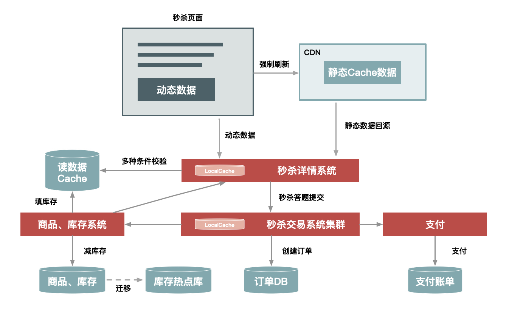
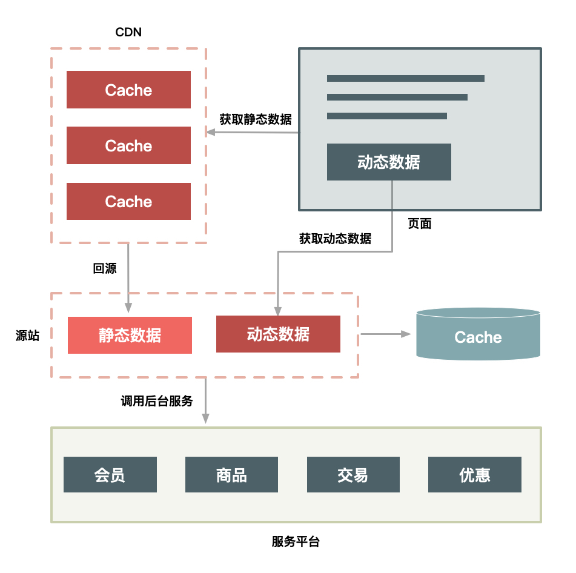
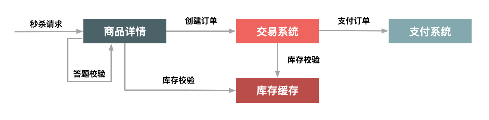
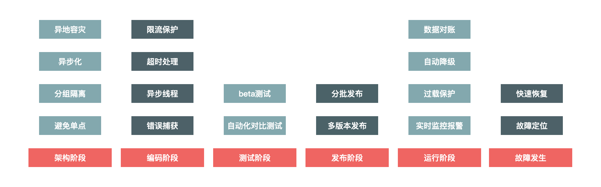

# 秒杀

## 开篇

为什么选择学习这方面的知识呢？这个问题对我来说很简单，在以往做项目的时候最苦恼的不是遇到各种bug不知道如何解决，

而是在进行数据库设计时常常开始雄心勃勃，最后往往写出屎山勉强实现功能。于是从那时起我就萌生了学习好数据库设计的的想法。

这不仅仅是表设计的问题，更有读写的设计。而秒杀就是能最好反映读写性能的应用场景。

在我看来，秒杀设计远不仅是八股内容，学好之后往往对于设计整体代码架构也有很好的帮助。

### 设计秒杀架构需要注意的几个点

浓缩成几个关键词就是**快、准、狠**和**高性能、一致性、高可用**

摘抄自极客时间的架构原则4要1不要

1. 数据要尽量少——用户请求的数据要少

3. 请求数要尽量少——用户请求的页面返回后，浏览器渲染这个页面还要包含其他的额外请求，比如说，这个页面依赖的CSS/JavaScript、图片，以及Ajax请求等等都定义为“额外请求”，这些额外请求应该尽量少。

5. 路径要尽量短——所谓“路径”，就是用户发出请求到返回数据这个过程中，需求经过的中间的节点数。

7. 依赖要尽量少——所谓依赖，指的是要完成一次用户请求必须依赖的系统或者服务，这里的依赖指的是强依赖。按照功能重要程度分成若干等级

9. 不要有单点——降低耦合度，应该设计分布式系统



这是一个淘宝早期秒杀活动的设计图

我自己简单总结几个比较关键的点

1，为尽可能少地从服务端获取数据，设置静态页面并且缓存数据到本地

2，分布式设计各个服务，降低耦合度

3，分集群部署，其实和第二点讲的差不多

4，设置必要的限流系统

> 2023/7/14 22:04 记录

## 如何做好动静分离

首先我们来谈一下如何做好“快”这一点

### 何为动静分离

数据分为动态数据和静态数据两种，主要就是看页面中的数据是否需要额外输出数据例如URL、用户信息、时间等和cookie相关的数据。

如果说像未登录界面很多人看都是一样的，那么这个数据就是静态数据

也就是说我们的工作重心就是在不妨碍用户体验的情况下尽可能地多使用静态数据，那么如何缓存静态数据就成为了关键

主要有三种处理缓存的方式

**第一，应该把数据缓存到离用户近的地方：**浏览器，CDN，服务端cache

**第二，使用简单的http连接**

**第三，使用效率高的缓存组件：**Web服务器（如Nginx、Apache、Varnish）或者redis非关系型数据库缓存键值对

### 如何做动静分离的改造

1. **URL唯一化**。商品详情系统天然地就可以做到URL唯一化，比如每个商品都由ID来标识，那么[http://item.xxx.com/item.htm?id=xxxx](http://item.xxx.com/item.htm?id=xxxx)就可以作为唯一的URL标识。为啥要URL唯一呢？前面说了我们是要缓存整个HTTP连接，那么以什么作为Key呢？就以URL作为缓存的Key，例如以id=xxx这个格式进行区分。

3. **分离浏览者相关的因素**。浏览者相关的因素包括是否已登录，以及登录身份等，这些相关因素我们可以单独拆分出来，通过动态请求来获取。

5. **分离时间因素**。服务端输出的时间也通过动态请求获取。

7. **异步化地域因素**。详情页面上与地域相关的因素做成异步方式获取，当然你也可以通过动态请求方式获取，只是这里通过异步获取更合适。

9. **去掉Cookie**。服务端输出的页面包含的Cookie可以通过代码软件来删除，如Web服务器Varnish可以通过unset req.http.cookie 命令去掉Cookie。注意，这里说的去掉Cookie并不是用户端收到的页面就不含Cookie了，而是说，在缓存的静态数据中不含有Cookie。

而动态内容的处理通常有两种方案：ESI（Edge Side Includes）方案和CSI（Client Side Include）方案。

1. **ESI方案（或者SSI）**：即在Web代理服务器上做动态内容请求，并将请求插入到静态页面中，当用户拿到页面时已经是一个完整的页面了。这种方式对服务端性能有些影响，但是用户体验较好。

3. **CSI方案**。即单独发起一个异步JavaScript 请求，以向服务端获取动态内容。这种方式服务端性能更佳，但是用户端页面可能会延时，体验稍差。

### 动静分离的架构方案



这是一种把cache缓存在CDN里的方法

页面被缓存在浏览器，如果强行刷新页面也只会到CDN里请求数据，用户点击“抢宝”按钮也不会刷新页面

除此之外还有分布式部署cache集群，网关+cache+Java三合一的缓存方式

## 有效处理热点数据

这节核心内容比较简单，因为热点数据往往会占用服务器更多的资源。所以我们需要对热点数据和非热点数据做一个区分

首先是处理热点数据，热点数据分为动态热点数据和静态热点数据

静态热点数据比较好处理，提前统计好然后缓存起来，用户请求热点数据时直接调用就行

动态热点数据发现系统需要做好异步抓去动态数据以及保证数据的实时性和统一性

### 处理热点数据

优化热点数据最好方法就是缓存热点数据，这点就不细说了

再来说说限制。限制更多的是一种保护机制，限制的办法也有很多，例如对被访问商品的ID做一致性Hash，然后根据Hash做分桶，每个分桶设置一个处理队列，这样可以把热点商品限制在一个请求队列里，防止因某些热点商品占用太多的服务器资源，而使其他请求始终得不到服务器的处理资源。

最后介绍一下隔离。秒杀系统设计的第一个原则就是将这种热点数据隔离出来，不要让1%的请求影响到另外的99%，隔离出来后也更方便对这1%的请求做针对性的优化。

具体到“秒杀”业务，我们可以在以下几个层次实现隔离。

1. **业务隔离**。把秒杀做成一种营销活动，卖家要参加秒杀这种营销活动需要单独报名，从技术上来说，卖家报名后对我们来说就有了已知热点，因此可以提前做好预热。

3. **系统隔离**。系统隔离更多的是运行时的隔离，可以通过分组部署的方式和另外99%分开。秒杀可以申请单独的域名，目的也是让请求落到不同的集群中。

5. **数据隔离**。秒杀所调用的数据大部分都是热点数据，比如会启用单独的Cache集群或者MySQL数据库来放热点数据，目的也是不想0.01%的数据有机会影响99.99%数据。

当然了，实现隔离有很多种办法。比如，你可以按照用户来区分，给不同的用户分配不同的Cookie，在接入层，路由到不同的服务接口中；再比如，你还可以在接入层针对URL中的不同Path来设置限流策略。服务层调用不同的服务接口，以及数据层通过给数据打标来区分等等这些措施，其目的都是把已经识别出来的热点请求和普通的请求区分开。

## 流量削峰

做好流量削峰是很重要的，如果同一时刻请求的数量过多就会引发服务器性能下降甚至是宕机。

点名我校抢课系统

### 为什么要削峰

服务请求有请求量大的时候也有请求量小的时候。如果按照请求量大的时候去分配资源，那么势必会造成资源的浪费，于是如何做好“错峰”就是关键

### 具体方案

#### 排队

首选的就是消息队列，我们会用消息队列做一个“门禁”，请求不能一股脑地涌进来，当请求量很多的时候，会有一个“漏斗”控制流速

但是，如果流量峰值持续一段时间达到了消息队列的处理上限，例如本机的消息积压达到了存储空间的上限，消息队列同样也会被压垮，这样虽然保护了下游的系统，但是和直接把请求丢弃也没多大的区别。就像遇到洪水爆发时，即使是有水库恐怕也无济于事。

除了消息队列，类似的排队方式还有很多，例如：

1. 利用线程池加锁等待也是一种常用的排队方式；

3. 先进先出、先进后出等常用的内存排队算法的实现方式；

5. 把请求序列化到文件中，然后再顺序地读文件（例如基于MySQL binlog的同步机制）来恢复请求等方式。

可以看到，这些方式都有一个共同特征，就是把“一步的操作”变成“两步的操作”，其中增加的一步操作用来起到缓冲的作用。

> 在一个技术交流群里看几个大哥吹水的时候就说到，很多用户会在点击一次请求失败的情况下连续点击很多下，导致远远超过
> 
> 本来计划的请求次数，于是本来只有很短的高峰时长大大延长了时间。所以光用消息队列可能也不太靠谱

#### 答题

你是否还记得，最早期的秒杀只是纯粹地刷新页面和点击购买按钮，它是后来才增加了答题功能的。那么，为什么要增加答题功能呢？

这主要是为了增加购买的复杂度，从而达到两个目的。

第一个目的是防止部分买家使用秒杀器在参加秒杀时作弊。2011年秒杀非常火的时候，秒杀器也比较猖獗，因而没有达到全民参与和营销的目的，所以系统增加了答题来限制秒杀器。增加答题后，下单的时间基本控制在2s后，秒杀器的下单比例也大大下降。

第二个目的就是延缓请求，能让系统更好支持瞬时的流量高峰



#### 分层

假如请求分别经过CDN、前台读系统（如商品详情系统）、后台系统（如交易系统）和数据库这几层

分层校验的目的是：在读系统中，尽量减少由于一致性校验带来的系统瓶颈，但是尽量将不影响性能的检查条件提前，如用户是否具有秒杀资格、商品状态是否正常、用户答题是否正确、秒杀是否已经结束、是否非法请求、营销等价物是否充足等；在写数据系统中，主要对写的数据（如“库存”）做一致性检查，最后在数据库层保证数据的最终准确性（如“库存”不能减为负数）。

分层校验的基本原则是：

1. 将动态请求的读数据缓存（Cache）在Web端，过滤掉无效的数据读；

3. 对读数据不做强一致性校验，减少因为一致性校验产生瓶颈的问题；

5. 对写数据进行基于时间的合理分片，过滤掉过期的失效请求；

7. 对写请求做限流保护，将超出系统承载能力的请求过滤掉；

9. 对写数据进行强一致性校验，只保留最后有效的数据。

## 性能优化

性能瓶颈主要集中在CPU上，这节内容很多都涉及到操作系统，我还不是很了解，所以就简单写点

### 如何优化

1，减少编码

如何才能减少编码呢？例如，网页输出是可以直接进行流输出的，即用resp.getOutputStream()函数写数据，把一些静态的数据提前转化成字节，等到真正往外写的时候再直接用OutputStream()函数写，就可以减少静态数据的编码转换。

2，减少序列化

序列化也是Java性能的一大天敌，减少Java中的序列化操作也能大大提升性能。又因为序列化往往是和编码同时发生的，所以减少序列化也就减少了编码。

序列化大部分是在RPC中发生的，因此避免或者减少RPC就可以减少序列化，当然当前的序列化协议也已经做了很多优化来提升性能。有一种新的方案，就是可以将多个关联性比较强的应用进行“合并部署”，而减少不同应用之间的RPC也可以减少序列化的消耗。

所谓“合并部署”，就是把两个原本在不同机器上的不同应用合并部署到一台机器上，当然不仅仅是部署在一台机器上，还要在同一个Tomcat容器中，且不能走本机的Socket，这样才能避免序列化的产生。

3，并发读优化

集中式缓存为了保证命中率一般都会采用一致性Hash，所以同一个key会落到同一台机器上。虽然单台缓存机器也能支撑30w/s的请求，但还是远不足以应对像“大秒”这种级别的热点商品。那么，该如何彻底解决单点的瓶颈呢？

答案是采用应用层的LocalCache，即在秒杀系统的单机上缓存商品相关的数据。

那么，又如何缓存（Cache）数据呢？你需要划分成动态数据和静态数据分别进行处理：

- 像商品中的“标题”和“描述”这些本身不变的数据，会在秒杀开始之前全量推送到秒杀机器上，并一直缓存到秒杀结束；

- 像库存这类动态数据，会采用“被动失效”的方式缓存一定时间（一般是数秒），失效后再去缓存拉取最新的数据。

## 减库存逻辑

如果你第一次接触秒杀，那你可能还不太理解，库存100件就卖100件，在数据库里减到0就好了啊，这有什么麻烦的？是的，理论上是这样，但是具体到业务场景中，“减库存”就不是这么简单了。

例如，我们平常购物都是这样，看到喜欢的商品然后下单，但并不是每个下单请求你都最后付款了。你说系统是用户下单了就算这个商品卖出去了，还是等到用户真正付款了才算卖出了呢？这的确是个问题！

我们可以先根据减库存是发生在下单阶段还是付款阶段，把减库存做一下划分。

### 减库存有哪几种方式

- **下单减库存**，即当买家下单后，在商品的总库存中减去买家购买数量。下单减库存是最简单的减库存方式，也是控制最精确的一种，下单时直接通过数据库的事务机制控制商品库存，这样一定不会出现超卖的情况。但是你要知道，有些人下完单可能并不会付款。

- **付款减库存**，即买家下单后，并不立即减库存，而是等到有用户付款后才真正减库存，否则库存一直保留给其他买家。但因为付款时才减库存，如果并发比较高，有可能出现买家下单后付不了款的情况，因为可能商品已经被其他人买走了。

- **预扣库存**，这种方式相对复杂一些，买家下单后，库存为其保留一定的时间（如10分钟），超过这个时间，库存将会自动释放，释放后其他买家就可以继续购买。在买家付款前，系统会校验该订单的库存是否还有保留：如果没有保留，则再次尝试预扣；如果库存不足（也就是预扣失败）则不允许继续付款；如果预扣成功，则完成付款并实际地减去库存。

### 减库存可能存在的问题

三种方案都各有问题，我们最好采用第三种方案，然后给商品设置最大购买件数，以及给恶意买家打上标签限制其购买

### 大型秒杀中如何减库存？

由于参加秒杀的商品，一般都是“抢到就是赚到”，所以成功下单后却不付款的情况比较少，再加上卖家对秒杀商品的库存有严格限制，所以秒杀商品采用“下单减库存”更加合理。另外，理论上由于“下单减库存”比“预扣库存”以及涉及第三方支付的“付款减库存”在逻辑上更为简单，所以性能上更占优势。

“下单减库存”在数据一致性上，主要就是保证大并发请求时库存数据不能为负数，也就是要保证数据库中的库存字段值不能为负数，一般我们有多种解决方案：一种是在应用程序中通过事务来判断，即保证减后库存不能为负数，否则就回滚；另一种办法是直接设置数据库的字段数据为无符号整数，这样减后库存字段值小于零时会直接执行SQL语句来报错；再有一种就是使用CASE WHEN判断语句，例如这样的SQL语句：

```
UPDATE item SET inventory = CASE WHEN inventory >= xxx THEN inventory-xxx ELSE inventory END
```

## 兜底方案

当出现意外时，我们该如何解决问题呢？如果因为庞大的流量导致服务器宕机，通常只能等待流量自动下降或者人为限制流量，这势必会影响用户体验

### 如何建设高可用方案



具体来说，系统的高可用建设涉及架构阶段、编码阶段、测试阶段、发布阶段、运行阶段，以及故障发生时。接下来，我们分别看一下。

1. **架构阶段**：架构阶段主要考虑系统的可扩展性和容错性，要避免系统出现单点问题。例如多机房单元化部署，即使某个城市的某个机房出现整体故障，仍然不会影响整体网站的运转。

3. **编码阶段**：编码最重要的是保证代码的健壮性，例如涉及远程调用问题时，要设置合理的超时退出机制，防止被其他系统拖垮，也要对调用的返回结果集有预期，防止返回的结果超出程序处理范围，最常见的做法就是对错误异常进行捕获，对无法预料的错误要有默认处理结果。

5. **测试阶段**：测试主要是保证测试用例的覆盖度，保证最坏情况发生时，我们也有相应的处理流程。

7. **发布阶段**：发布时也有一些地方需要注意，因为发布时最容易出现错误，因此要有紧急的回滚机制。

9. **运行阶段**：运行时是系统的常态，系统大部分时间都会处于运行态，运行态最重要的是对系统的监控要准确及时，发现问题能够准确报警并且报警数据要准确详细，以便于排查问题。

11. **故障发生**：故障发生时首先最重要的就是及时止损，例如由于程序问题导致商品价格错误，那就要及时下架商品或者关闭购买链接，防止造成重大资产损失。然后就是要能够及时恢复服务，并定位原因解决问题。

### 降级

所谓“降级”，就是当系统的容量达到一定程度时，限制或者关闭系统的某些非核心功能，从而把有限的资源保留给更核心的业务。它是一个有目的、有计划的执行过程，所以对降级我们一般需要有一套预案来配合执行。如果我们把它系统化，就可以通过预案系统和开关系统来实现降级。

降级方案可以这样设计：当秒杀流量达到5w/s时，把成交记录的获取从展示20条降级到只展示5条。“从20改到5”这个操作由一个开关来实现，也就是设置一个能够从开关系统动态获取的系统参数。

执行降级无疑是在系统性能和用户体验之间选择了前者，降级后肯定会影响一部分用户的体验，例如在双11零点时，如果优惠券系统扛不住，可能会临时降级商品详情的优惠信息展示，把有限的系统资源用在保障交易系统正确展示优惠信息上，即保障用户真正下单时的价格是正确的。所以降级的核心目标是牺牲次要的功能和用户体验来保证核心业务流程的稳定，是一个不得已而为之的举措。

## 限流

如果说降级是牺牲了一部分次要的功能和用户的体验效果，那么限流就是更极端的一种保护措施了。限流就是当系统容量达到瓶颈时，我们需要通过限制一部分流量来保护系统，并做到既可以人工执行开关，也支持自动化保护的措施。

这里，我同样给出了限流系统的示意图。总体来说，限流既可以是在客户端限流，也可以是在服务端限流。此外，限流的实现方式既要支持URL以及方法级别的限流，也要支持基于QPS和线程的限流。

首先，我以内部的系统调用为例，来分别说下客户端限流和服务端限流的优缺点。

- **客户端限流**，好处可以限制请求的发出，通过减少发出无用请求从而减少对系统的消耗。缺点就是当客户端比较分散时，没法设置合理的限流阈值：如果阈值设的太小，会导致服务端没有达到瓶颈时客户端已经被限制；而如果设的太大，则起不到限制的作用。

- **服务端限流**，好处是可以根据服务端的性能设置合理的阈值，而缺点就是被限制的请求都是无效的请求，处理这些无效的请求本身也会消耗服务器资源。

## 拒绝服务

如果限流还不能解决问题，最后一招就是直接拒绝服务了。

当系统负载达到一定阈值时，例如CPU使用率达到90%或者系统load值达到2\*CPU核数时，系统直接拒绝所有请求，这种方式是最暴力但也最有效的系统保护方式。例如秒杀系统，我们在如下几个环节设计过载保护：

> 在最前端的Nginx上设置过载保护，当机器负载达到某个值时直接拒绝HTTP请求并返回503错误码，在Java层同样也可以设计过载保护。

拒绝服务可以说是一种不得已的兜底方案，用以防止最坏情况发生，防止因把服务器压跨而长时间彻底无法提供服务。像这种系统过载保护虽然在过载时无法提供服务，但是系统仍然可以运作，当负载下降时又很容易恢复，所以每个系统和每个环节都应该设置这个兜底方案，对系统做最坏情况下的保护。
