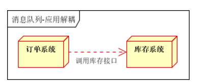
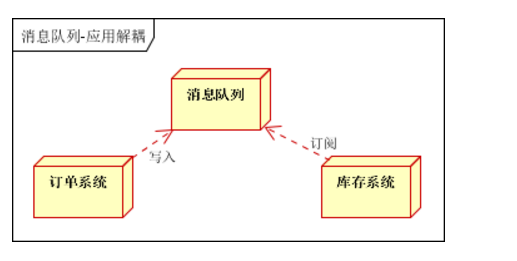
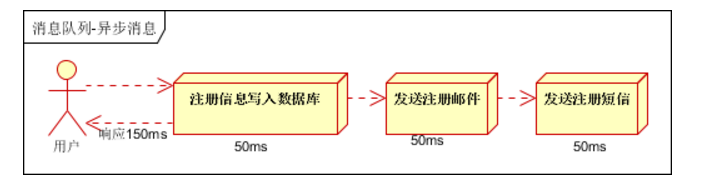
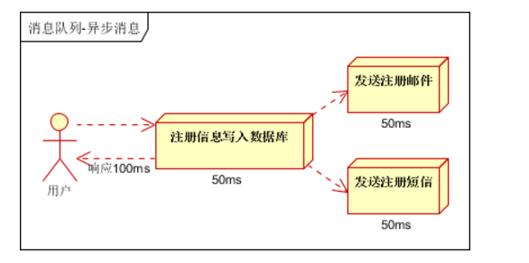
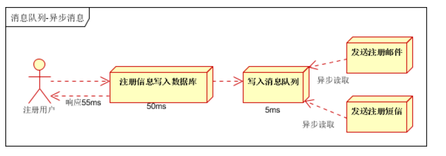
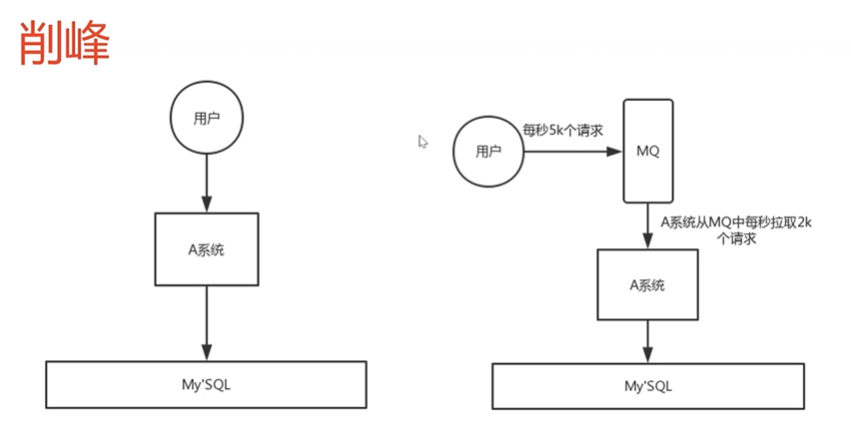
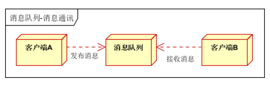
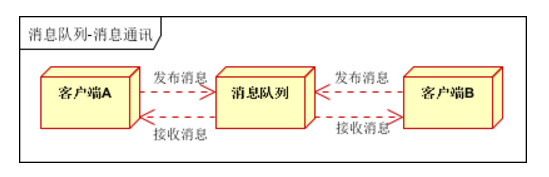
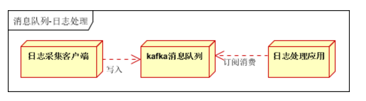

刚开始学消息队列的时候觉得这个东西真难应用，不知道能拿来干嘛以及怎么放到实际生产环境中进行实现。现在我稍微明白一点了，用我自己的话来讲就是扑克牌一副一共就那么多张却可以拿来斗地主，炸金花，德州很多种玩法。消息队列亦是如此。

## 一，解耦

最经典的应用场景就是订单系统，在应用消息队列之后用户下单成功即立刻返回，然后把消息传递给支付系统，支付系统等待用户付款，如此便实现了解耦。如果没有使用消息队列那么对整个系统都是一个负担。首先整个下单-支付系统流程会被拉长，服务器资源势必被浪费，整个项目的维护也会变得十分困难

## 二，异步

异步比较好理解，顾名思义，可以使多个服务同时进行，进而降低总服务所消耗的时间，能很大程度上优化用户体验，当然也会对性能有更高要求

## 三，流量削峰

我觉得这也是消息队列最常用的地方之一

在请求量大的场景中，如果流量过高就会一下把服务器冲垮，但是消息队列的存在就可以使一条拥挤的马路上的车辆依次排队通行，已经超出上限则会暂时将其拦在外面。如果外面的消息过多则会丢弃

## 四，消息通讯

前不久我做聊天功能就用到了消息队列，实现用户与用户之间或者用户与群组之间的点对点通讯，还需要客户端轮询聊天记录接口

感觉非常的好用😄，用起来比websocket舒服

## 五，日志处理

这个东西其实也比较经典，特别是对于kafka来说，因为kafka的一大特点就是高吞吐量，所以在日志比较多的场景经常使用kafka来获取传递日志给logstash或者es啥的日志管理组件进行后续的处理，但是因为对日志需求比较大的场景通常是非常庞大的项目（应该），所以平时一般也用不到消息队列处理日志

## 总结

消息队列的使用能帮我们解决很多问题，但是使用消息队列也会使项目结构进一步复杂，可用性降低，难以debug等等，这些也是我们不得不面对的。对于消息队列可用性，容错性，底层实现等有机会再讲
